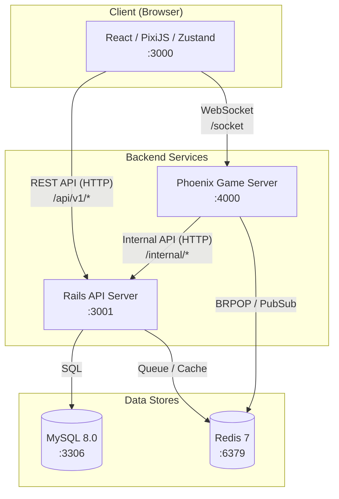
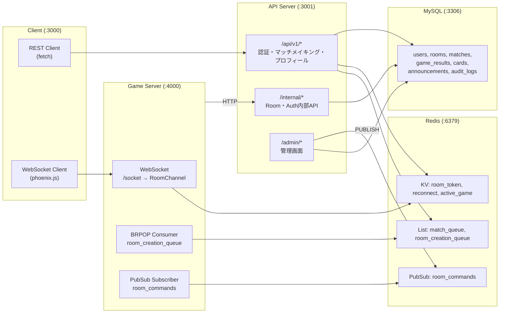
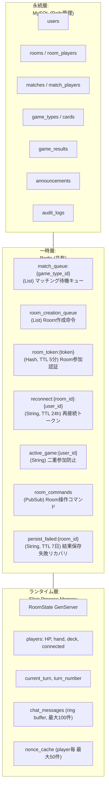
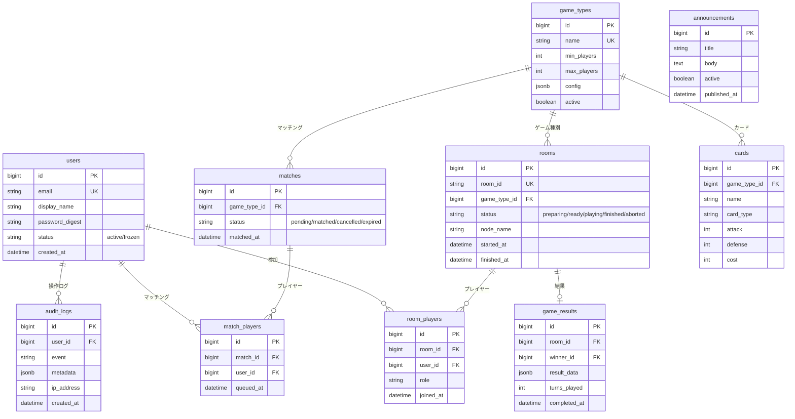

# アーキテクチャ概要

## システム全体構成



## サービス間接続の詳細



## データフロー（3層構造）



## ER図



## ディレクトリ構造

```
room-based-multiplayer-poc/
├── client/                     # TypeScript/React/PixiJS Webクライアント
│   └── src/
│       ├── components/         # Auth, Lobby, Game, Chat 画面コンポーネント
│       ├── stores/             # Zustand 状態管理 (auth, lobby, game, chat)
│       ├── services/           # WebSocket接続・REST API呼び出し
│       ├── game/               # PixiJS ゲーム描画ロジック
│       ├── schemas/            # Zod バリデーションスキーマ
│       └── types/              # TypeScript型定義
│
├── api-server/                 # Ruby on Rails API + 管理画面
│   └── app/
│       ├── controllers/
│       │   ├── api/v1/         # 認証・マッチメイキング・プロフィール
│       │   ├── admin/          # 管理画面 (users, rooms, announcements)
│       │   └── internal/       # Phoenix → Rails 内部API
│       ├── models/             # User, Room, GameType, Match, Card等
│       ├── serializers/        # Alba JSONシリアライザ
│       ├── services/           # Matchmaking, RoomCreation, JWT
│       └── jobs/               # バックグラウンドジョブ
│
├── game-server/                # Elixir/Phoenix ゲームサーバー
│   └── lib/
│       ├── game_server/
│       │   ├── rooms/          # Room GenServer, Supervisor
│       │   ├── games/          # Game Behaviour, SimpleCardBattle実装
│       │   ├── consumers/      # Redis BRPOP (Room作成)
│       │   └── subscribers/    # Redis PubSub (Room操作コマンド)
│       └── game_server_web/
│           └── channels/       # UserSocket, RoomChannel
│
├── infra/                      # Docker Compose, MySQL/Redis設定
├── specs/                      # 機能仕様書
└── docs/                       # プロジェクトドキュメント
```

## 設計原則

| レイヤー | 責務 | やらないこと |
|---------|------|------------|
| **Client** | 表示・入力のみ | ゲームロジック、バリデーション |
| **Rails (API Server)** | 認証、マッチメイキング、永続化、管理 | ゲーム状態管理、リアルタイム通信 |
| **Phoenix (Game Server)** | ゲーム実行、ルーム管理、チャット、再接続 | データ永続化、ユーザー管理 |

すべてのゲームアクションはサーバー側で検証される **サーバーオーソリタティブ** アーキテクチャです。
