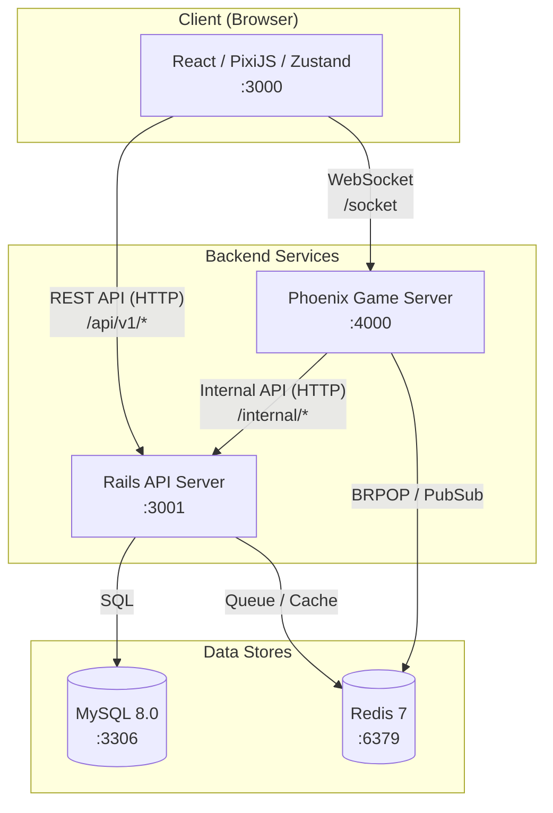
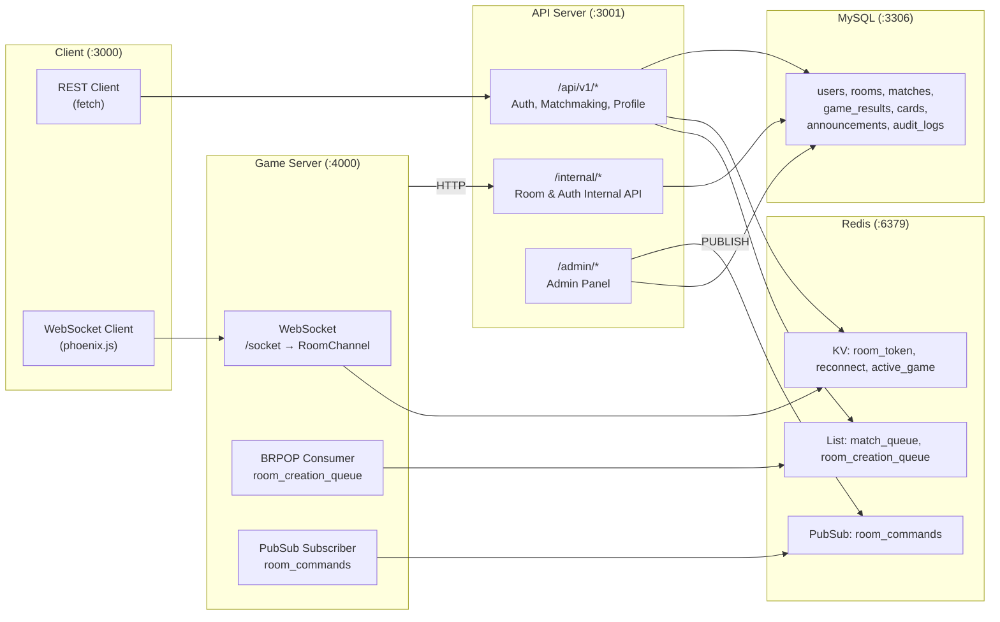
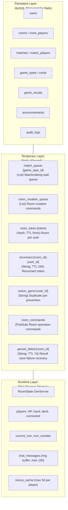
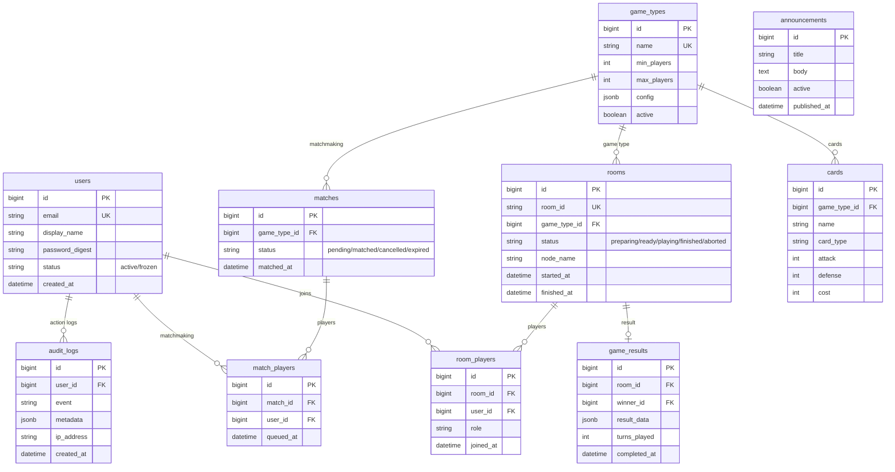

# Architecture Overview

## System Overview



## Service Connection Details



## Data Flow (3-Layer Architecture)



## ER Diagram



## Directory Structure

```
room-based-multiplayer-poc/
├── client/                     # TypeScript/React/PixiJS web client
│   └── src/
│       ├── components/         # Auth, Lobby, Game, Chat screen components
│       ├── stores/             # Zustand state management (auth, lobby, game, chat)
│       ├── services/           # WebSocket connection & REST API calls
│       ├── game/               # PixiJS game rendering logic
│       ├── schemas/            # Zod validation schemas
│       └── types/              # TypeScript type definitions
│
├── api-server/                 # Ruby on Rails API + Admin panel
│   └── app/
│       ├── controllers/
│       │   ├── api/v1/         # Auth, matchmaking, profile
│       │   ├── admin/          # Admin panel (users, rooms, announcements)
│       │   └── internal/       # Phoenix → Rails internal API
│       ├── models/             # User, Room, GameType, Match, Card, etc.
│       ├── serializers/        # Alba JSON serializers
│       ├── services/           # Matchmaking, RoomCreation, JWT
│       └── jobs/               # Background jobs
│
├── game-server/                # Elixir/Phoenix game server
│   └── lib/
│       ├── game_server/
│       │   ├── rooms/          # Room GenServer, Supervisor
│       │   ├── games/          # Game Behaviour, SimpleCardBattle implementation
│       │   ├── consumers/      # Redis BRPOP (Room creation)
│       │   └── subscribers/    # Redis PubSub (Room operation commands)
│       └── game_server_web/
│           └── channels/       # UserSocket, RoomChannel
│
├── infra/                      # Docker Compose, MySQL/Redis config
├── specs/                      # Feature specifications
└── docs/                       # Project documentation
```

## Design Principles

| Layer | Responsibilities | Out of Scope |
|-------|-----------------|--------------|
| **Client** | Display and input only | Game logic, validation |
| **Rails (API Server)** | Auth, matchmaking, persistence, admin | Game state management, real-time communication |
| **Phoenix (Game Server)** | Game execution, room management, chat, reconnection | Data persistence, user management |

This is a **server-authoritative** architecture where all game actions are validated server-side.
