**「初期プロジェクトを開始するために必要な情報を、1つの設計ドキュメントとして再統合」**したものです。
README / 設計書 / ADR のベースとしてそのまま使える構成・粒度でまとめています。

このプロジェクトでは、以下に記載の機能要件を満たす、汎用的なルームマッチ型のゲーム構成を実現します。
このプロジェクトで実装されたクライアント、サーバの機能をもとにゲームロジックやUI等を実装することで、特定のルームマッチ型ゲームを実装することができるようにします。

---

# 1. 要件整理

## 1.1 機能要件

### ゲーム

* 1ルーム 1〜10数名
* PvPカードゲーム / ボードゲーム など
* ターン制
* サーバ主導進行
* ルームチャット
* グローバルチャット
* 再接続対応

### 管理・運営

* カード・ゲーム設定の動的変更
* DSLによる設定
* ロールバック可能
* 管理UI（Rails）

---

## 1.2 技術要件

### クライアント

* Webブラウザ（初期）
* PixiJS + TypeScript
* WebSocket通信
* 将来：Unity（同Protocol）

### APIサーバ

* Ruby on Rails
* MySQL
* Redis
* OpenAPI（外部）
* Internal API（内部）

### ルーム / チャット / ゲームサーバ

* Elixir
* Phoenix
* WebSocket
* 全ルーム常駐プロセス

### インフラ

* Docker
* Private Network（内部通信）

---

## 1.3 非機能要件

* 高可用性（途中切断耐性）
* チート耐性
* 長期運営（5年以上）
* 運営事故防止（DSL検証）
* バージョン共存

---

# 2. 全体アーキテクチャ


---

# 3. 論理アーキテクチャ（責務）

## 3.1 クライアント

* 描画
* 入力
* アニメーション
* サーバ状態の反映

❌ ゲームロジック
❌ 判定

---

## 3.2 Rails

* 認証 / 認可
* ユーザー管理
* マッチング
* ルーム参加権発行
* DSL保存・構文検証
* 管理UI

---

## 3.3 Elixir

* ルーム生成・管理
* ゲーム進行
* ゲーム状態保持
* DSL実行
* チャット処理
* reconnect管理

---

# 4. 認証・トークン設計

## 4.1 トークン種別

| トークン        | 用途       | 保存   |
| --------------- | ---------- | ------ |
| access_token    | API        | Client |
| room_token      | ルーム参加 | Client |
| reconnect_token | 再接続     | Elixir |

---

# 5. フロー定義（シーケンス図）

## 5.1 認証フロー

### API

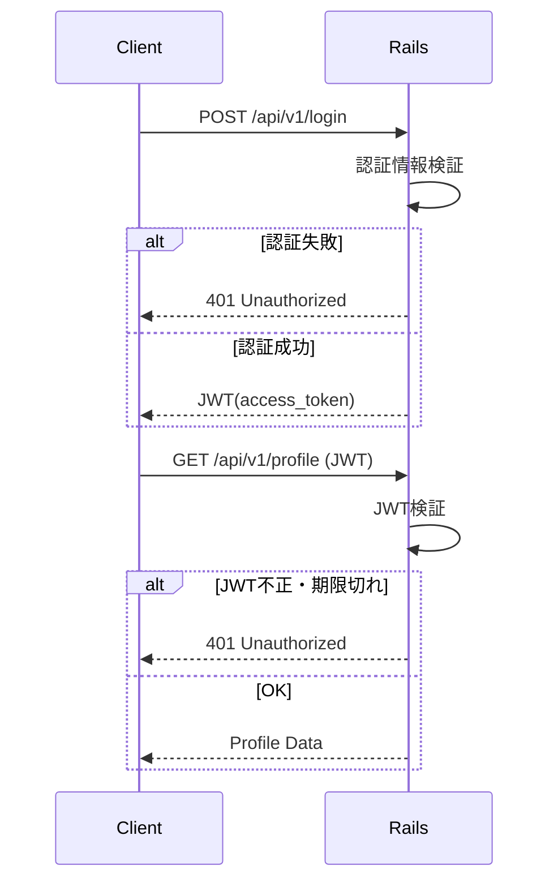

### Elixir（Phoenix）

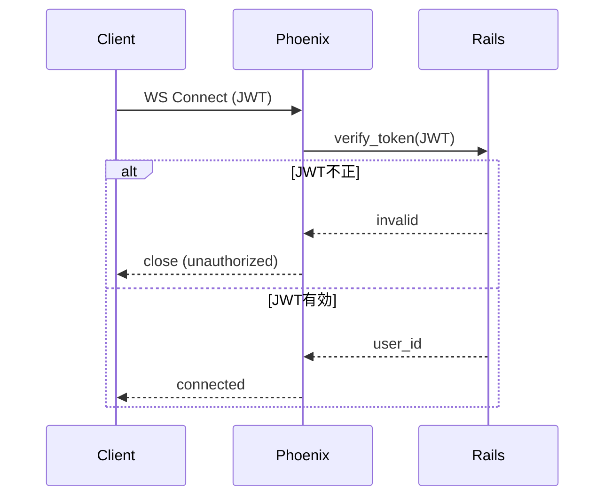

---

## 5.2 ルームマッチング〜参加

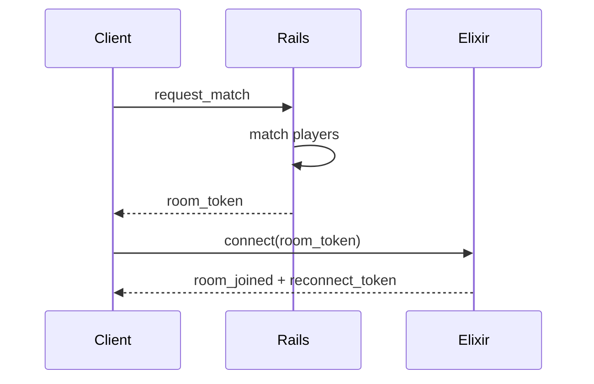

---

## 5.3 ルーム開始

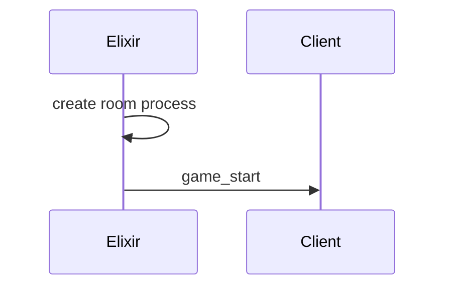

---

## 5.4 チャット接続

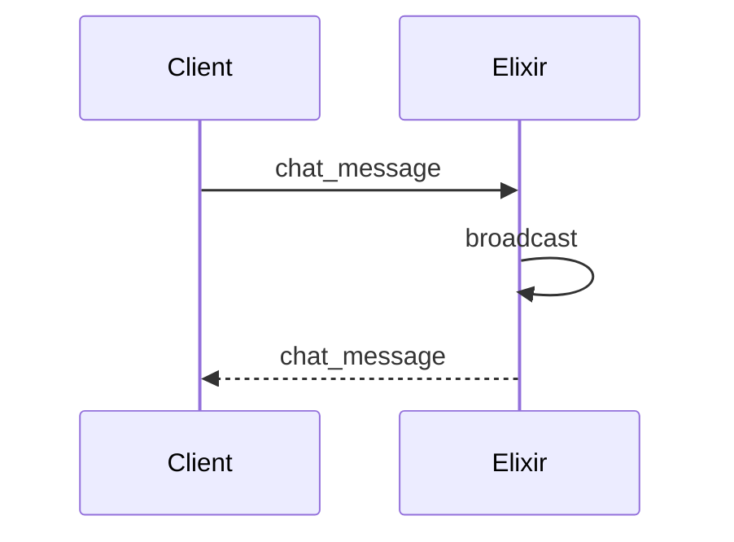

---

## 5.5 API再接続（アクセストークン失効）

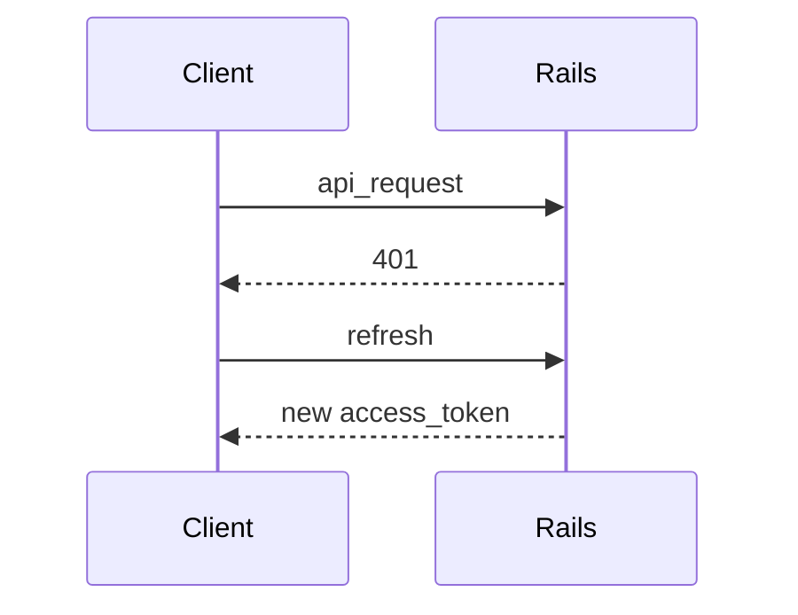

---

## 5.6 ルーム再接続

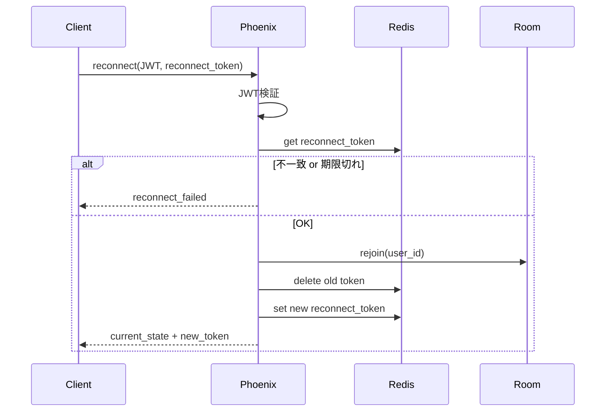

---

## 5.7 ルーム終了処理

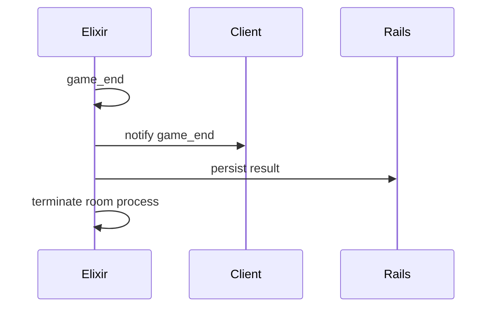

---

# 6. 認証・接続状態遷移図

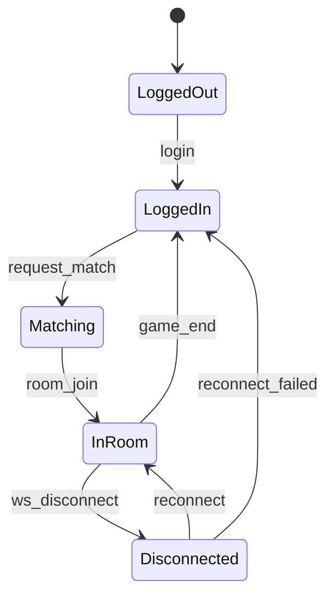

---

# 7. ゲーム設定DSL設計

## 7.1 目的

* 実装なしでカード追加
* 数値・挙動調整
* 運営が読める・書ける

---

## 7.2 DSLの性質

| 項目   | 方針           |
| ------ | -------------- |
| 完全性 | 非チューリング |
| 制御   | 禁止           |
| 実行   | Elixirのみ     |
| 検証   | Rails + Elixir |

---

## 7.3 DSL例（card定義）

```dsl
card fireball:
  cost: 2
  target: opponent
  effect:
    deal_damage amount=3 + self.attack
```

---

## 7.4 DSL構文要素

### Expression

* 定数
* 変数（self.xxx）
* 四則演算

### Condition

```dsl
when self.hp < 5:
  heal amount=3
```

### Effect（最小）

| Effect      | 内容     |
| ----------- | -------- |
| deal_damage | ダメージ |
| heal        | 回復     |
| draw_card   | ドロー   |
| add_status  | 状態付与 |

---

## 7.5 DSL責務分離

| 項目     | Rails | Elixir |
| -------- | ----- | ------ |
| 構文検証 | ✓     | ✓      |
| AST生成  | ✓     | ✓      |
| 意味解析 | ✗     | ✓      |
| 実行     | ✗     | ✓      |

---

# 8. データ設計（概要）

## Rails（MySQL）

* users
* rooms
* matches
* cards
* card_dsl_versions
* audit_logs

## Elixir（メモリ）

* room_state
* player_state
* reconnect_tokens

---

# 9. セキュリティ要件

| 脅威     | 対策          |
| -------- | ------------- |
| 不正接続 | トークン      |
| リプレイ | nonce         |
| チート   | サーバ主導    |
| DSL事故  | Schema / 検証 |

---

# 10. 設計思想（最重要）

> **クライアントは描画だけ
> Railsは運用を守る
> Elixirはゲームを守る**

---

# 11. 初期MVP構築順

1. Rails認証
2. Elixirルーム1つ
3. Pixi表示
4. WebSocket接続
5. DSLカード1枚
6. reconnect対応

---

# 認証アーキテクチャ


# WebSocket接続のアーキテクチャ


# Internal API アーキテクチャ


了解です。
ここは **設計の中核**なので、曖昧さが残らないように

* ① **ルーム開始の責務分解（誰が何を決めるか）**
* ② **Client / Rails / Phoenix 連携シーケンス**
* ③ **ルームライフサイクル図（状態遷移）**

を **mermaid 図付きで**きっちり整理します。

---

# 1. 前提整理（超重要）

まず、設計上の大前提を明文化します。

## 1.1 ルームに関する責務

| 項目         | 担当      |
| ---------- | ------- |
| マッチング      | Rails   |
| ルームID採番    | Rails   |
| ルーム作成トリガ   | Rails   |
| 実ルームプロセス生成 | Phoenix |
| ルーム状態管理    | Phoenix |
| 永続化（結果など）  | Rails   |

👉 **Railsが「事務局」、Phoenixが「現場」**

---

## 1.2 ルームの実体はどこにあるか

* **論理ルーム**：Rails（DB）
* **実行ルーム**：Phoenix（Elixir Process）

Railsは
「この room_id は存在する／進行中／終了した」
という **メタ情報のみを保持**します。

---

# 2. ルーム開始フロー（全体像）

### ユースケース

> プレイヤーが「ゲーム開始」を押す

---

# 3. ルーム開始シーケンス図（詳細）

## 3.1 マッチング〜ルーム生成まで

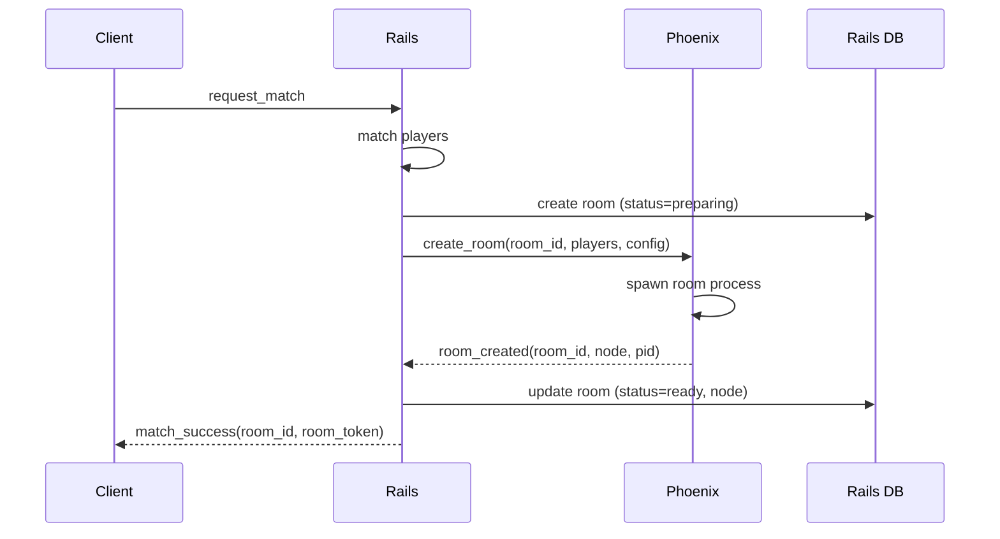

### ポイント解説

* **room_idはRailsが発行**
* Phoenixは **room_idを受け取って起動**
* Phoenixは **勝手にroom_idを作らない**
* Railsは **「Phoenixに存在する」ことを確認してから Client に返す**

---

## 3.2 Client → Phoenix ルーム参加

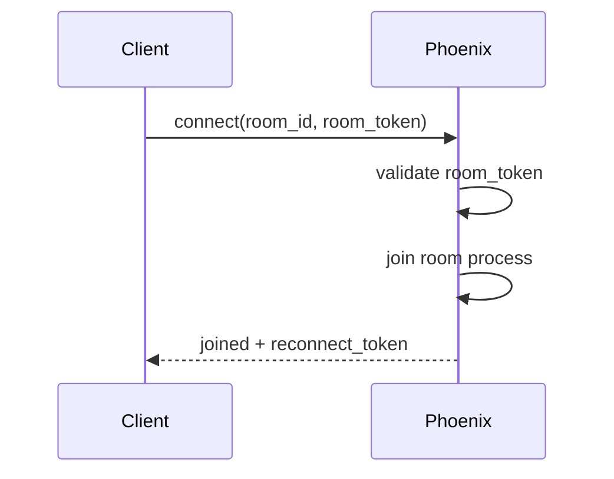

---

## 3.3 全員揃った後のゲーム開始

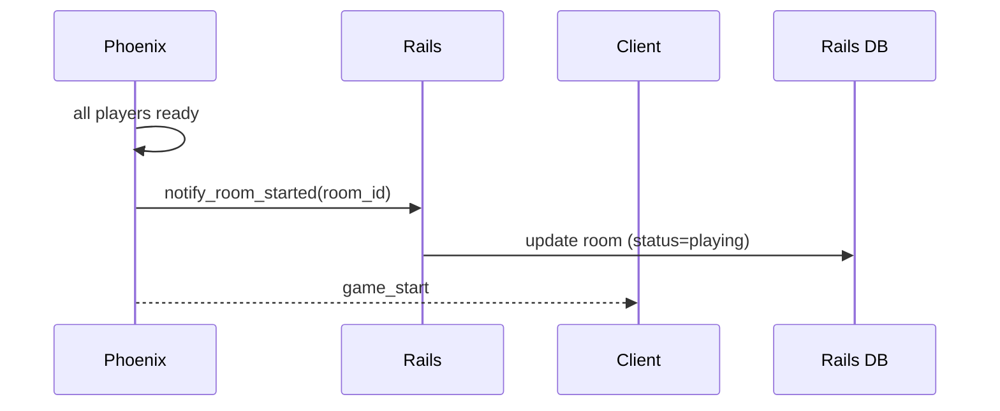

---

# 4. Railsが「ルームを知り、保持する」設計

## 4.1 rooms テーブル（例）

```sql
rooms
- id (uuid)
- status (preparing / ready / playing / finished)
- node_name
- created_at
- finished_at
```

Railsは以下だけを保証：

* このroom_idは正規
* 今どの状態か
* 終了したか

---

## 4.2 Phoenixが持つもの

Phoenix側（プロセス内）：

* プレイヤー状態
* ゲーム状態
* reconnect_token
* DSL実行結果

👉 **ゲーム進行中の詳細はRailsに置かない**

---

# 5. ルームライフサイクル図（状態遷移）

## 5.1 ルーム状態遷移（Rails視点）

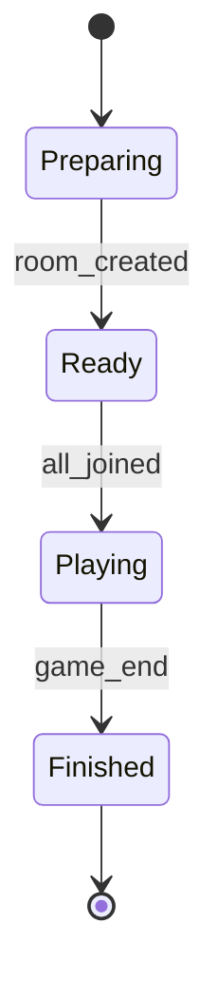

---

## 5.2 ルーム状態遷移（Phoenix視点）

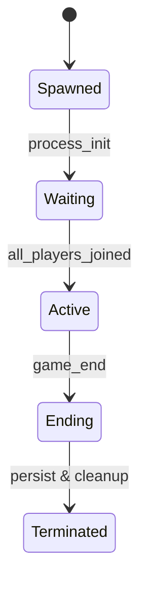

---

# 6. 異常系も含めた重要パターン

## 6.1 Phoenixでルーム作成失敗

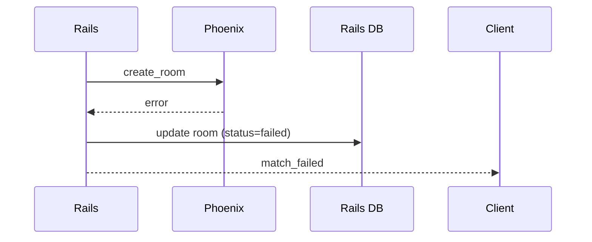

---

## 6.2 Clientが誰も来ない場合（タイムアウト）

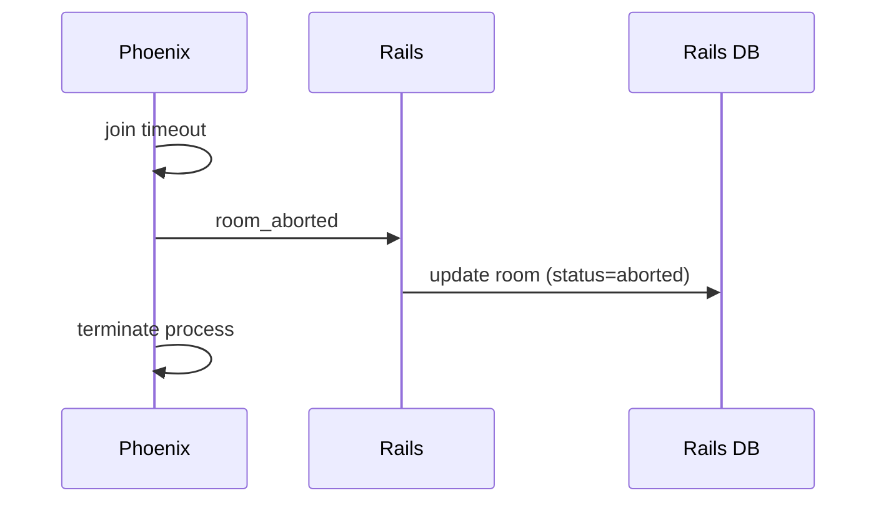

---

# 7. この設計のメリットまとめ

### 👍 良い点

* 責務が明確
* 再起動・再接続に強い
* ルームの幽霊化を防げる
* 運営・監視しやすい

### ⚠ 注意点

* Rails ↔ Phoenix 内部APIは必須
* Phoenixノード管理が必要
* room_id一貫性を壊さないこと

---

# 8. 設計判断として残すべき一文

> **ルームの存在を決めるのはRails、
> ルームを生かすのはPhoenix。
> 勝手に作らせない、勝手に消させない。**

---

了解です。
ここは **運用・障害耐性・スケール設計の肝**なので、
「図で見れば迷わない」レベルまで落とします。

以下の3点を、**設計思想 → 図 → 補足**の順で整理します。

---

# 1. reconnect を含む「プレイヤーライフサイクル」

## 1.1 基本方針

* プレイヤーは **論理的には常に room に所属**
* 接続（socket）は **一時的**
* reconnect は「復帰」であり「再参加」ではない
* reconnect_token が **同一プレイヤー性の唯一の証明**

---

## 1.2 プレイヤー状態遷移図（Phoenix視点）

```mermaid
stateDiagram-v2
    [*] --> Unconnected

    Unconnected --> Connected : connect(room_token)
    Connected --> InRoom : join_room

    InRoom --> TemporarilyDisconnected : socket_closed
    TemporarilyDisconnected --> InRoom : reconnect(reconnect_token)

    TemporarilyDisconnected --> Left : reconnect_timeout
    InRoom --> Left : voluntary_leave

    Left --> [*]
```

---

## 1.3 reconnect シーケンス（詳細）

```mermaid
sequenceDiagram
    participant Client
    participant Phoenix

    Client->>Phoenix: reconnect(room_id, reconnect_token)
    Phoenix->>Phoenix: validate reconnect_token
    Phoenix->>Phoenix: restore player state
    Phoenix-->>Client: reconnected(state_snapshot)
```

### ポイント

* **状態スナップショットはPhoenixが保持**
* Railsは reconnect を知らなくてよい
* reconnect_token は

  * room_id
  * player_id
  * 有効期限
    を内包

---

## 1.4 reconnect 不可ケース

| ケース      | 挙動     |
| -------- | ------ |
| 期限切れ     | 参加不可   |
| room 終了  | 参加不可   |
| token 不正 | 拒否     |
| 同時二重接続   | 古い方を切断 |

---

# 2. グローバルチャット vs ルームチャット構成

## 2.1 設計方針

| 項目   | グローバル    | ルーム   |
| ---- | -------- | ----- |
| 寿命   | 長期       | ルーム限定 |
| 永続化  | あり       | 原則なし  |
| 接続数  | 多        | 少     |
| 負荷特性 | ブロードキャスト | 少人数   |

👉 **同じElixirでも責務は分離**

---

## 2.2 アーキテクチャ構成図

```mermaid
architecture
    group client[Client]
    group phoenix[Phoenix Cluster]
    group rails[Rails]
    group infra[Infra]

    client -- WebSocket --> phoenix.global_chat
    client -- WebSocket --> phoenix.room_chat

    phoenix.global_chat -- REST --> rails
    phoenix.room_chat -- REST --> rails

    rails -- DB --> infra.mysql
    rails -- Cache --> infra.redis
```

---

## 2.3 Phoenix 内部構成

```mermaid
architecture
    group phoenix[Phoenix]
    service GlobalChat
    service RoomSupervisor
    service RoomProcess

    GlobalChat --> PhoenixPubSub
    RoomSupervisor --> RoomProcess
    RoomProcess --> PhoenixPubSub
```

---

## 2.4 なぜ分けるか？

### グローバルチャット

* Channel常駐
* PubSubブロードキャスト
* Redis / DB 永続化連携

### ルームチャット

* RoomProcess内包
* ゲーム状態と強く結合
* 終了時に破棄

---

# 3. Phoenixクラスタ構成時の room 配置

## 3.1 基本思想

* **1 room = 1 process**
* **1 process = 1 node**
* room は移動しない
* reconnect は「同じ node に戻る」

---

## 3.2 クラスタ構成図

```mermaid
architecture
    group client[Client]
    group lb[LoadBalancer]

    group phoenix_cluster[Phoenix Cluster]
    service node1[Node A]
    service node2[Node B]
    service node3[Node C]

    client --> lb
    lb --> node1
    lb --> node2
    lb --> node3
```

---

## 3.3 room 配置フロー

```mermaid
sequenceDiagram
    participant Rails
    participant NodeA
    participant NodeB

    Rails->>NodeA: create_room(room_id)
    NodeA->>NodeA: spawn room process
    NodeA-->>Rails: room_created(node=A)
```

Railsは **node_name を DB に保存**

---

## 3.4 reconnect 時のルーティング

```mermaid
sequenceDiagram
    participant Client
    participant LB
    participant NodeA

    Client->>LB: reconnect(room_id)
    LB->>LB: lookup room_id -> NodeA
    LB->>NodeA: forward connection
```

### 方法

* L7 LoadBalancer
* または Rails API で node 解決
* または Phoenix Presence + Registry

---

## 3.5 ノード障害時の扱い

| 障害               | 対応               |
| ---------------- | ---------------- |
| Node落ち           | room 強制終了        |
| Client reconnect | 失敗扱い             |
| Rails            | room を aborted に |

👉 **途中復旧は狙わない（複雑すぎる）**
