**「初期プロジェクトを開始するために必要な情報を、1つの設計ドキュメントとして再統合」**したものです。
README / 設計書 / ADR のベースとしてそのまま使える構成・粒度でまとめています。

このプロジェクトでは、以下に記載の機能要件を満たす、汎用的なルームマッチ型のゲーム構成を実現します。
このプロジェクトで実装されたクライアント、サーバの機能をもとにゲームロジックやUI等を実装することで、特定のルームマッチ型ゲームを実装することができるようにします。

---

# 1. 要件整理

## 1.1 機能要件

### ゲーム

* 1ルーム 1〜10数名
* PvPカードゲーム / ボードゲーム など
* ターン制
* サーバ主導進行
* ルームチャット
* グローバルチャット
* 再接続対応

### 管理・運営

* カード・ゲーム設定の動的変更
* DSLによる設定
* ロールバック可能
* 管理UI（Rails）

---

## 1.2 技術要件

### クライアント

* Webブラウザ（初期）
* PixiJS + TypeScript（ゲーム描画）
* DOM UI: React または Vue（推奨: React）。メニュー・チャット・設定など
* WebSocket通信
* 将来：Unity（同Protocol）

### APIサーバ

* Ruby on Rails
* MySQL
* Redis
* OpenAPI（外部）
* Internal API（内部）

### ルーム / チャット / ゲームサーバ

* Elixir
* Phoenix
* WebSocket
* 全ルーム常駐プロセス

### インフラ

* Docker
* Private Network（内部通信）

---

## 1.3 非機能要件

* 高可用性（途中切断耐性）
* チート耐性
* 長期運営（5年以上）
* 運営事故防止（DSL検証）
* バージョン共存

---

# 2. 全体アーキテクチャ


---

# 3. 論理アーキテクチャ（責務）

## 3.1 クライアント

* 描画
* 入力
* アニメーション
* サーバ状態の反映

❌ ゲームロジック
❌ 判定

---

## 3.2 Rails

* 認証 / 認可
* ユーザー管理
* マッチング
* ルーム参加権発行
* DSL保存・構文検証
* 管理UI

---

## 3.3 Elixir

* ルーム生成・管理
* ゲーム進行
* ゲーム状態保持
* DSL実行
* チャット処理
* reconnect管理

---

# 4. 認証・トークン設計

## 4.1 トークン種別

| トークン        | 用途       | 保存   |
| --------------- | ---------- | ------ |
| access_token    | API        | Client |
| room_token      | ルーム参加 | Client |
| reconnect_token | 再接続     | Elixir |

---

# 5. フロー定義（シーケンス図）

## 5.1 認証フロー

### API

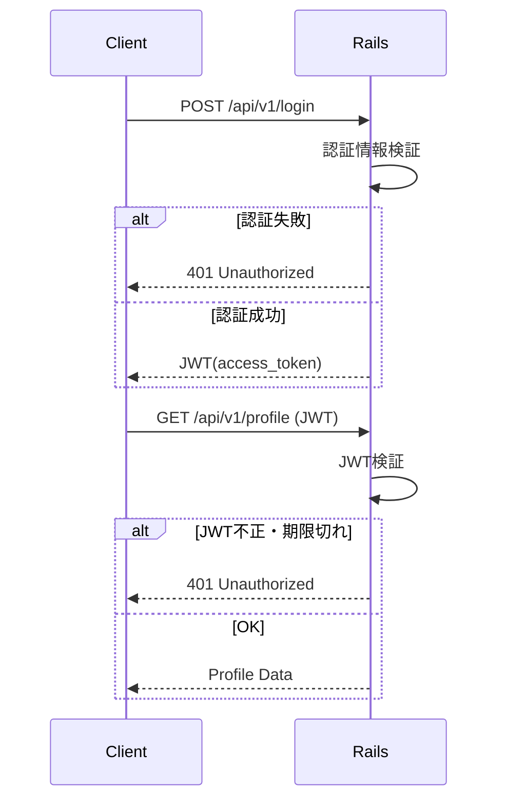

### Elixir（Phoenix）

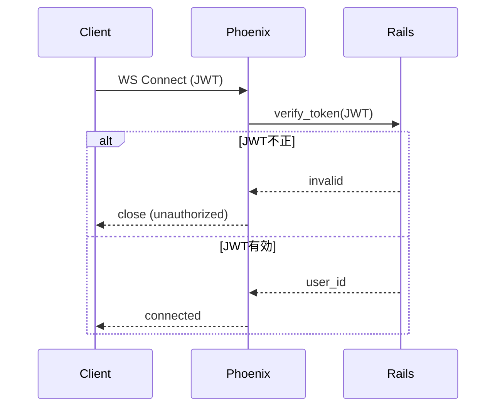

---

## 5.2 ルームマッチング〜参加

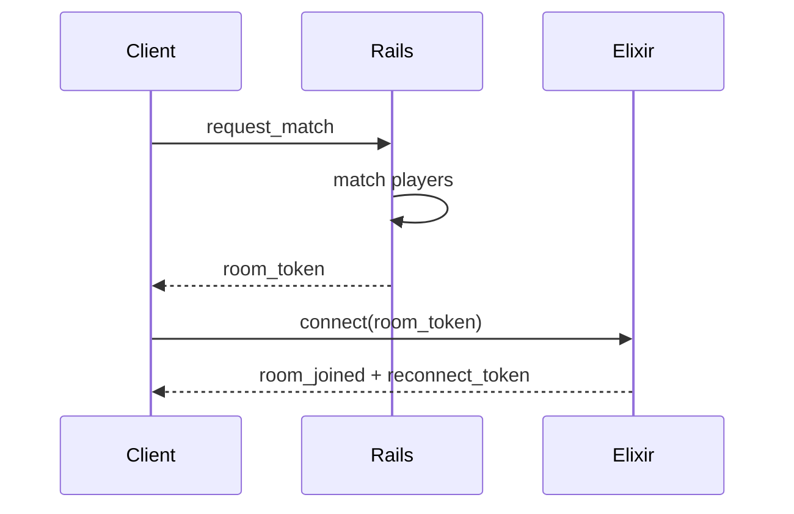

---

## 5.3 ルーム開始

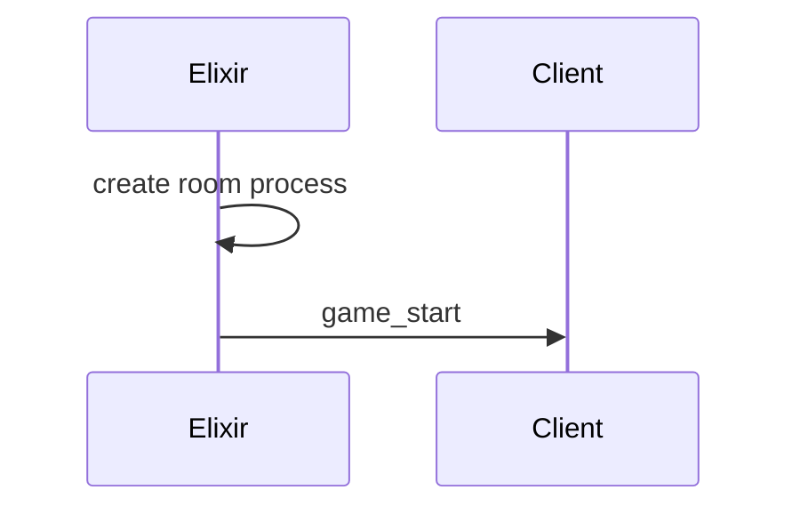

---

## 5.4 チャット接続

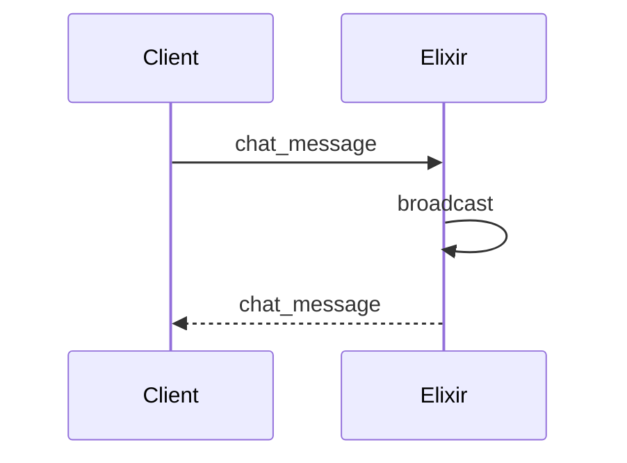

---

## 5.5 API再接続（アクセストークン失効）

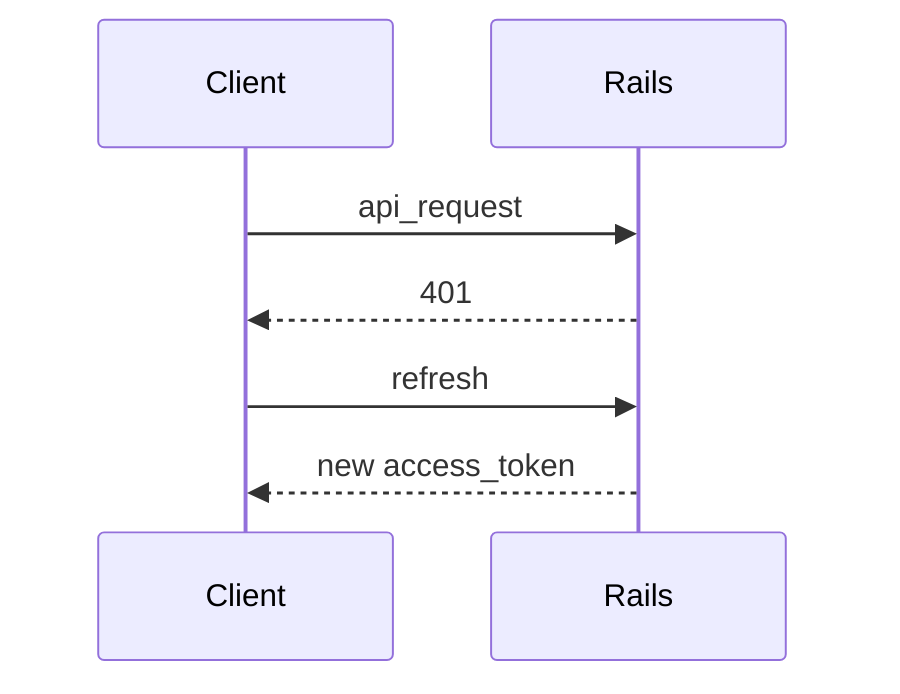

---

## 5.6 ルーム再接続

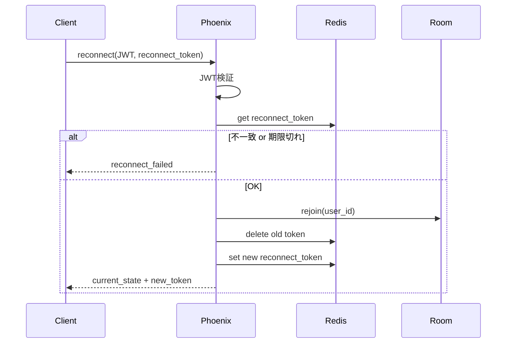

---

## 5.7 ルーム終了処理

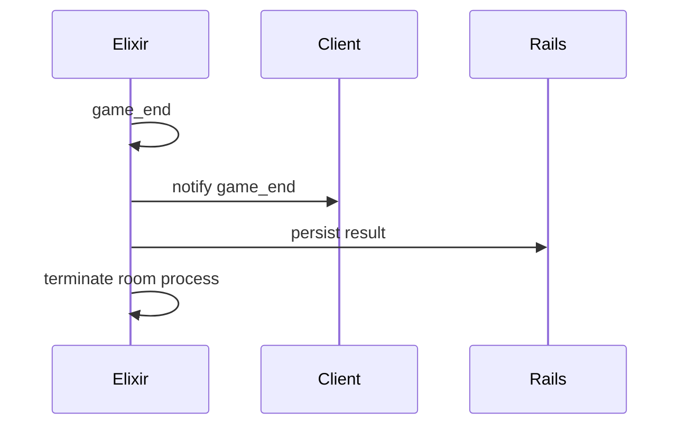

---

# 6. 認証・接続状態遷移図

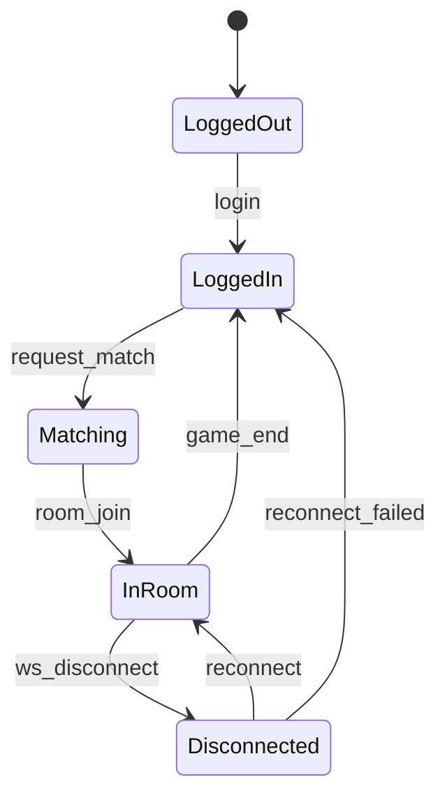

---

# 7. ゲーム設定DSL設計

## 7.1 目的

* 実装なしでカード追加
* 数値・挙動調整
* 運営が読める・書ける

---

## 7.2 DSLの性質

| 項目   | 方針           |
| ------ | -------------- |
| 完全性 | 非チューリング |
| 制御   | 禁止           |
| 実行   | Elixirのみ     |
| 検証   | Rails + Elixir |

---

## 7.3 DSL例（card定義）

```dsl
card fireball:
  cost: 2
  target: opponent
  effect:
    deal_damage amount=3 + self.attack
```

---

## 7.4 DSL構文要素

### Expression

* 定数
* 変数（self.xxx）
* 四則演算

### Condition

```dsl
when self.hp < 5:
  heal amount=3
```

### Effect（最小）

| Effect      | 内容     |
| ----------- | -------- |
| deal_damage | ダメージ |
| heal        | 回復     |
| draw_card   | ドロー   |
| add_status  | 状態付与 |

---

## 7.5 DSL責務分離

| 項目     | Rails | Elixir |
| -------- | ----- | ------ |
| 構文検証 | ✓     | ✓      |
| AST生成  | ✓     | ✓      |
| 意味解析 | ✗     | ✓      |
| 実行     | ✗     | ✓      |

---

# 8. データ設計（概要）

## Rails（MySQL）

* users
* rooms
* matches
* cards
* card_dsl_versions
* audit_logs

## Elixir（メモリ）

* room_state
* player_state
* reconnect_tokens

---

# 9. セキュリティ要件

| 脅威     | 対策          |
| -------- | ------------- |
| 不正接続 | トークン      |
| リプレイ | nonce         |
| チート   | サーバ主導    |
| DSL事故  | Schema / 検証 |

---

# 10. 設計思想（最重要）

> **クライアントは描画だけ
> Railsは運用を守る
> Elixirはゲームを守る**

---

# 11. 初期MVP構築順

1. Rails認証
2. Elixirルーム1つ
3. Pixi表示
4. WebSocket接続
5. ハードコードによるゲームロジック1種（カード1枚相当）
6. reconnect対応
7. 管理UI最低ライン（解消19参照）

### MVPスコープに関する注記

| 項目 | MVP | 備考 |
|------|-----|------|
| DSL | **MVP外** | 長期運用のコア機能として設計は維持するが、初期はElixirコード＋DB/設定ファイルで管理。プロダクトの成長に応じて導入 |
| グローバルチャット | **MVP外** | ルームチャットのみ先行実装。グローバルチャットは運用開始後に追加 |
| Redis冗長構成 | **MVP外** | 初期は単一インスタンス。運用開始時にSentinel構成へ移行（解消17参照） |

---

# 認証・接続のサマリ図（概要）

以下 3 図は概要用。**詳細は §4 認証・トークン設計・§5 フロー定義・§2 全体アーキテクチャ、および末尾「設計の解消事項」を参照。**

## 認証アーキテクチャ（サマリ）


## WebSocket接続のアーキテクチャ（サマリ）


## Internal API アーキテクチャ（サマリ）


※ 上記 3 図の詳細・解消事項: **§4・§5・§2 および本ドキュメント末尾「設計の解消事項」** を参照。

---

了解です。
ここは **設計の中核**なので、曖昧さが残らないように

* ① **ルーム開始の責務分解（誰が何を決めるか）**
* ② **Client / Rails / Phoenix 連携シーケンス**
* ③ **ルームライフサイクル図（状態遷移）**

を **mermaid 図付きで**きっちり整理します。

---

# 1. 前提整理（超重要）

まず、設計上の大前提を明文化します。

## 1.1 ルームに関する責務

| 項目         | 担当      |
| ---------- | ------- |
| マッチング      | Rails   |
| ルームID採番    | Rails   |
| ルーム作成トリガ   | Rails   |
| 実ルームプロセス生成 | Phoenix |
| ルーム状態管理    | Phoenix |
| 永続化（結果など）  | Rails   |

👉 **Railsが「事務局」、Phoenixが「現場」**

---

## 1.2 ルームの実体はどこにあるか

* **論理ルーム**：Rails（DB）
* **実行ルーム**：Phoenix（Elixir Process）

Railsは
「この room_id は存在する／進行中／終了した」
という **メタ情報のみを保持**します。

---

# 2. ルーム開始フロー（全体像）

### ユースケース

> プレイヤーが「ゲーム開始」を押す

---

# 3. ルーム開始シーケンス図（詳細）

## 3.1 マッチング〜ルーム生成まで

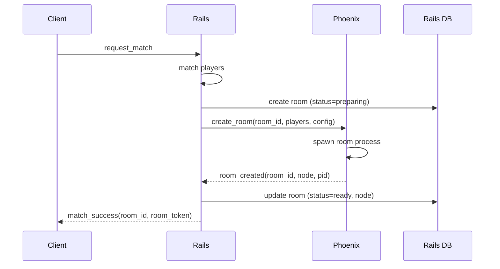

### ポイント解説

* **room_idはRailsが発行**
* Phoenixは **room_idを受け取って起動**
* Phoenixは **勝手にroom_idを作らない**
* Railsは **「Phoenixに存在する」ことを確認してから Client に返す**

---

## 3.2 Client → Phoenix ルーム参加

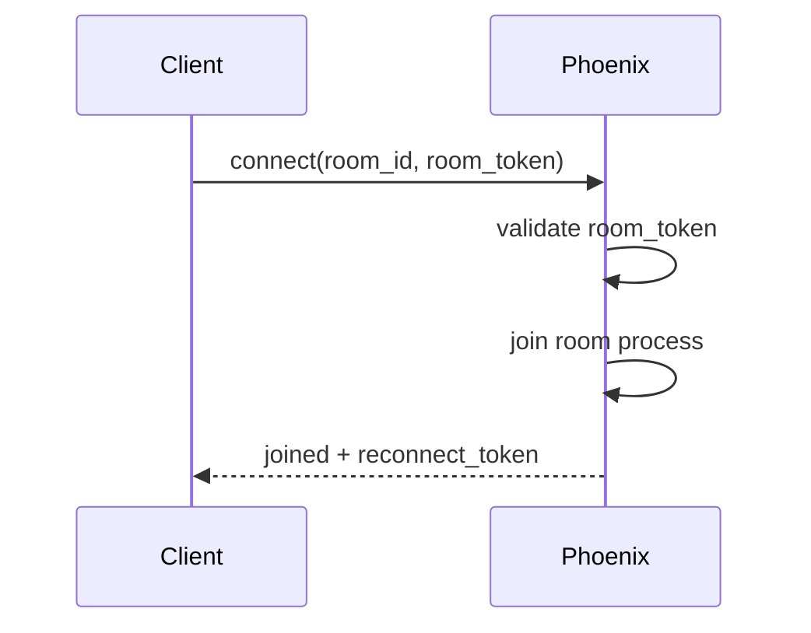

---

## 3.3 全員揃った後のゲーム開始

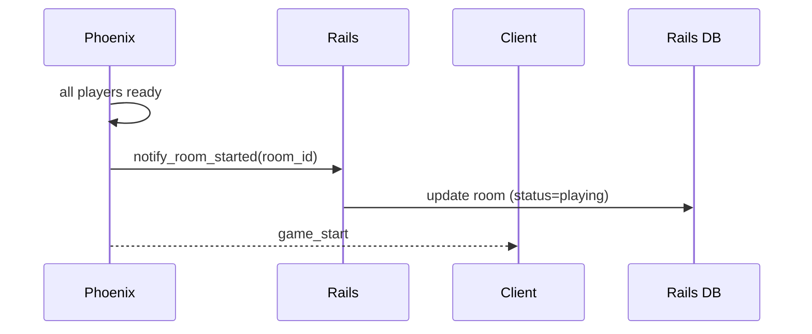

---

# 4. Railsが「ルームを知り、保持する」設計

## 4.1 rooms テーブル（例）

```sql
rooms
- id (uuid)
- status (preparing / ready / playing / finished)
- node_name
- created_at
- finished_at
```

Railsは以下だけを保証：

* このroom_idは正規
* 今どの状態か
* 終了したか

---

## 4.2 Phoenixが持つもの

Phoenix側（プロセス内）：

* プレイヤー状態
* ゲーム状態
* reconnect_token
* DSL実行結果

👉 **ゲーム進行中の詳細はRailsに置かない**

---

# 5. ルームライフサイクル図（状態遷移）

## 5.1 ルーム状態遷移（Rails視点）

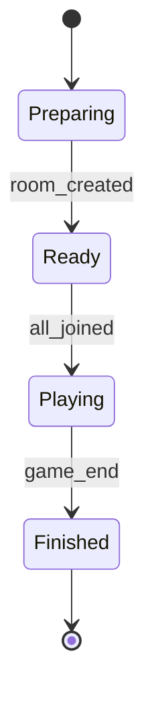

---

## 5.2 ルーム状態遷移（Phoenix視点）

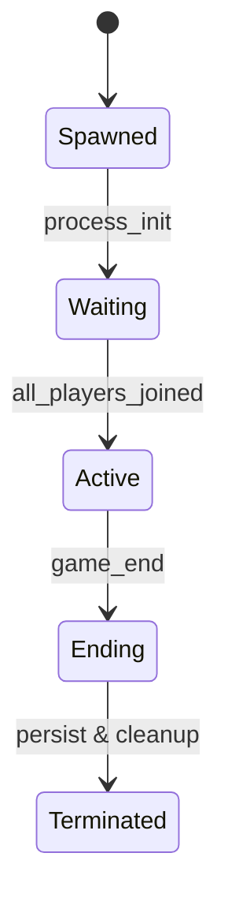

---

# 6. 異常系も含めた重要パターン

## 6.1 Phoenixでルーム作成失敗

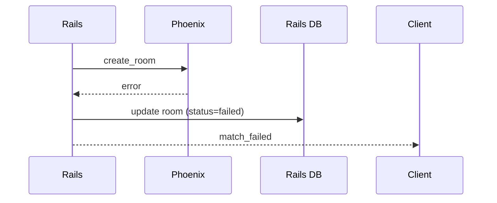

---

## 6.2 Clientが誰も来ない場合（タイムアウト）

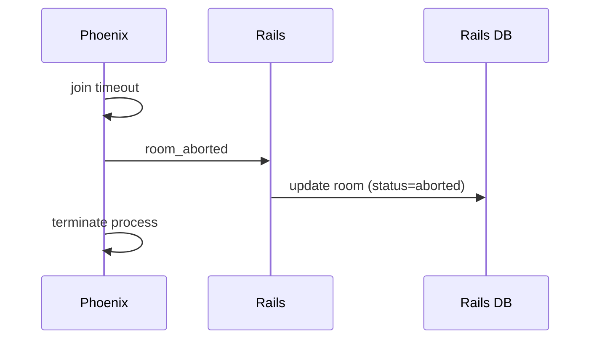

---

# 7. この設計のメリットまとめ

### 👍 良い点

* 責務が明確
* 再起動・再接続に強い
* ルームの幽霊化を防げる
* 運営・監視しやすい

### ⚠ 注意点

* Rails ↔ Phoenix 内部APIは必須
* Phoenixノード管理が必要
* room_id一貫性を壊さないこと

---

# 8. 設計判断として残すべき一文

> **ルームの存在を決めるのはRails、
> ルームを生かすのはPhoenix。
> 勝手に作らせない、勝手に消させない。**

---

了解です。
ここは **運用・障害耐性・スケール設計の肝**なので、
「図で見れば迷わない」レベルまで落とします。

以下の3点を、**設計思想 → 図 → 補足**の順で整理します。

---

# 1. reconnect を含む「プレイヤーライフサイクル」

## 1.1 基本方針

* プレイヤーは **論理的には常に room に所属**
* 接続（socket）は **一時的**
* reconnect は「復帰」であり「再参加」ではない
* reconnect_token が **同一プレイヤー性の唯一の証明**

---

## 1.2 プレイヤー状態遷移図（Phoenix視点）

```mermaid
stateDiagram-v2
    [*] --> Unconnected

    Unconnected --> Connected : connect(room_token)
    Connected --> InRoom : join_room

    InRoom --> TemporarilyDisconnected : socket_closed
    TemporarilyDisconnected --> InRoom : reconnect(reconnect_token)

    TemporarilyDisconnected --> Left : reconnect_timeout
    InRoom --> Left : voluntary_leave

    Left --> [*]
```

---

## 1.3 reconnect シーケンス（詳細）

```mermaid
sequenceDiagram
    participant Client
    participant Phoenix

    Client->>Phoenix: reconnect(room_id, reconnect_token)
    Phoenix->>Phoenix: validate reconnect_token
    Phoenix->>Phoenix: restore player state
    Phoenix-->>Client: reconnected(state_snapshot)
```

### ポイント

* **状態スナップショットはPhoenixが保持**
* Railsは reconnect を知らなくてよい
* reconnect_token は

  * room_id
  * player_id
  * 有効期限
    を内包

---

## 1.4 reconnect 不可ケース

| ケース      | 挙動     |
| -------- | ------ |
| 期限切れ     | 参加不可   |
| room 終了  | 参加不可   |
| token 不正 | 拒否     |
| 同時二重接続   | 古い方を切断 |

---

# 2. グローバルチャット vs ルームチャット構成

## 2.1 設計方針

| 項目   | グローバル    | ルーム   |
| ---- | -------- | ----- |
| 寿命   | 長期       | ルーム限定 |
| 永続化  | あり       | 原則なし  |
| 接続数  | 多        | 少     |
| 負荷特性 | ブロードキャスト | 少人数   |

👉 **同じElixirでも責務は分離**

---

## 2.2 アーキテクチャ構成図

```mermaid
architecture
    group client[Client]
    group phoenix[Phoenix Cluster]
    group rails[Rails]
    group infra[Infra]

    client -- WebSocket --> phoenix.global_chat
    client -- WebSocket --> phoenix.room_chat

    phoenix.global_chat -- REST --> rails
    phoenix.room_chat -- REST --> rails

    rails -- DB --> infra.mysql
    rails -- Cache --> infra.redis
```

---

## 2.3 Phoenix 内部構成

```mermaid
architecture
    group phoenix[Phoenix]
    service GlobalChat
    service RoomSupervisor
    service RoomProcess

    GlobalChat --> PhoenixPubSub
    RoomSupervisor --> RoomProcess
    RoomProcess --> PhoenixPubSub
```

---

## 2.4 なぜ分けるか？

### グローバルチャット

* Channel常駐
* PubSubブロードキャスト
* Redis / DB 永続化連携

### ルームチャット

* RoomProcess内包
* ゲーム状態と強く結合
* 終了時に破棄

---

# 3. Phoenixクラスタ構成時の room 配置

## 3.1 基本思想

* **1 room = 1 process**
* **1 process = 1 node**
* room は移動しない
* reconnect は「同じ node に戻る」

---

## 3.2 クラスタ構成図

```mermaid
architecture
    group client[Client]
    group lb[LoadBalancer]

    group phoenix_cluster[Phoenix Cluster]
    service node1[Node A]
    service node2[Node B]
    service node3[Node C]

    client --> lb
    lb --> node1
    lb --> node2
    lb --> node3
```

---

## 3.3 room 配置フロー

```mermaid
sequenceDiagram
    participant Rails
    participant NodeA
    participant NodeB

    Rails->>NodeA: create_room(room_id)
    NodeA->>NodeA: spawn room process
    NodeA-->>Rails: room_created(node=A)
```

Railsは **node_name を DB に保存**

---

## 3.4 reconnect 時のルーティング

```mermaid
sequenceDiagram
    participant Client
    participant LB
    participant NodeA

    Client->>LB: reconnect(room_id)
    LB->>LB: lookup room_id -> NodeA
    LB->>NodeA: forward connection
```

### 方法

* L7 LoadBalancer
* または Rails API で node 解決
* または Phoenix Presence + Registry

---

## 3.5 ノード障害時の扱い

| 障害               | 対応               |
| ---------------- | ---------------- |
| Node落ち           | room 強制終了        |
| Client reconnect | 失敗扱い             |
| Rails            | room を aborted に |

👉 **途中復旧は狙わない（複雑すぎる）**

---

# 設計の解消事項（課題・欠陥の整理）

全体像レビューで洗い出した**重大な欠陥**と**課題**について、方針を決め文書化したものです。今後の詳細設計・実装の前提として参照してください。

---

## 解消1. room_token の検証方法（重大な欠陥）

### 課題
Phoenix が「誰が・どこで」room_token を検証するかが未定義だった。Rails 発行のトークンを Phoenix が検証する経路が必要。

### 方針

| 項目 | 内容 |
|------|------|
| 検証主体 | Phoenix が検証する |
| 検証方法 | **Redis で検証**。Rails が room_token 発行時に Redis に書き、Phoenix は connect(room_token) 受信時に Redis のキー存在・有効期限を確認する |
| 保存キー例 | `room_token:{token}` → `{ room_id, user_id, expires_at }`（または JWT 内に room_id/user_id を含め Redis には expires のみ） |
| 改ざん耐性 | room_token は署名付き（JWT または HMAC）とし、Phoenix は Rails と共有する secret で検証する |

### シーケンス（補足）

```mermaid
sequenceDiagram
    participant Client
    participant Rails
    participant Phoenix
    participant Redis

    Client->>Rails: request_match
    Rails->>Rails: match players, create room
    Rails->>Redis: set room_token (room_id, user_id, TTL)
    Rails-->>Client: room_token

    Client->>Phoenix: connect(room_token)
    Phoenix->>Redis: get room_token / verify
    alt 不正 or 期限切れ
        Phoenix-->>Client: 401 / close
    else OK
        Phoenix->>Phoenix: join room
        Phoenix->>Redis: delete room_token（参加成功後は無効化）
        Phoenix-->>Client: joined + reconnect_token
    end
```

### room_token のライフサイクル（課題8と統合）

| タイミング | 扱い |
|------------|------|
| 発行 | Rails が match 成功時に発行。有効期限は発行から **5 分**（要運用チューニング） |
| 使用 | 1 回限り有効。Phoenix が join 成功時に Redis から削除（または used フラグ）し、再利用を防ぐ |
| 未使用期限切れ | Redis TTL で自動削除。期限切れで connect した場合は Phoenix が拒否 |

### 追記: join 成功前のネットワーク切断

join 成功時に即 Redis 削除する設計では、Client が `joined` 応答を受け取る前にネットワークが切れた場合、トークンは削除済みだが参加できていない状態が発生しうる。

| 対策案 | 内容 |
|--------|------|
| 短時間保持 | 削除ではなく「used」フラグ＋短 TTL（例: 10秒）で保持し、その間の再接続を許可 |
| ACKベース | Client からの join 完了 ACK を受けてから無効化する |

初期は「短時間保持」方式を採用し、運用で問題があれば ACK 方式に移行する。

---

## 解消2. マッチングの仕様（重大な欠陥）

### 課題
「match players」のみで、募集型か即マッチか・人数の決め方・キュー・タイムアウトが未定義だった。

### 方針（初期 MVP を前提に固定）

| 項目 | 内容 |
|------|------|
| 方式 | **即マッチ（マッチングキュー）**。プレイヤーが「マッチング開始」を押すとキューに入り、条件を満たすとルームができる |
| 人数 | **ゲーム種別ごとに固定**（例: 2人対戦なら 2人）。Rails のマッチング設定またはルームタイプで保持 |
| キュー | Rails がキューを管理（Redis リストまたは DB）。同一ゲーム種別・同一人数の待ちプレイヤーを N 人集めた時点で create_room を発行 |
| タイムアウト | キュー待ち **60 秒**（要運用チューニング）でマッチしなければ一旦キューから外し、クライアントに「マッチできませんでした」を返す |
| キャンセル | クライアントから「マッチングキャンセル」を送信したらキューから削除 |

### 補足
* 募集型（ルーム作成→他プレイヤーが参加）は将来拡張とする。現時点では「Rails が N 人を揃えて 1 ルーム作成」のみとする。
* 「全員参加」の定義は **解消13** にて記載。

---

## 解消3. reconnect 時のノード解決（重大な欠陥）

### 課題
「LB が room_id で NodeA に転送」とあったが、L7 LB が room_id からノードをどう知るかが未定義だった。

### 方針

**Client が「接続先を Rails に問い合わせてから、その WS に繋ぐ」フローを採用する。**

| 項目 | 内容 |
|------|------|
| 経路 | Client → Rails API: `GET /api/v1/rooms/:room_id/ws_endpoint`（または Internal 用の `reconnect_info`） → Rails が `rooms.node_name` を参照し、そのノードの WebSocket URL を返す |
| 返却例 | `{ "ws_url": "wss://node-a.example.com/socket/room", "node": "node_a" }`。Client はこの URL に reconnect_token 付きで WebSocket 接続する |
| LB の役割 | 初回接続は LB がラウンドロビン等でよい。**reconnect 時は Client が既にノード特定済みの URL を使うため、LB は「ノード別のルーティング」をしなくてよい**（ノード直の URL を返す構成でも可） |

### シーケンス（更新）

```mermaid
sequenceDiagram
    participant Client
    participant Rails
    participant PhoenixNodeA

    Client->>Rails: GET /api/v1/rooms/:room_id/ws_endpoint (JWT)
    Rails->>Rails: room 存在・status 確認
    Rails-->>Client: ws_url (node 固定)

    Client->>PhoenixNodeA: WebSocket reconnect(room_id, reconnect_token)
    PhoenixNodeA->>PhoenixNodeA: validate token, rejoin
    PhoenixNodeA-->>Client: reconnected(state_snapshot) + new reconnect_token
```

### 注意
* ノード直 URL を返す場合、そのノード障害時は Client は reconnect_failed となり、ゲーム復帰は諦める（既存方針のまま）。

### 追記: Rails が reconnect 時の SPOF になるリスク

reconnect 時に Rails API でノード解決する設計のため、Rails 停止中は稼働中ゲームへの復帰もできなくなる。

| 時期 | 対策 |
|------|------|
| 初期 | 許容する。Rails の可用性を高めることで対応 |
| 将来 | Client が最後に接続したノード情報をローカルにキャッシュし、Rails 不通時はキャッシュから直接 reconnect を試みる |

---

## 解消4. Rails ↔ Phoenix の障害時の一貫性（重大な欠陥）

### 課題
Phoenix の create_room 失敗は 6.1 で記載済み。逆に **Rails が落ちているとき**、および **persist result 失敗時**の扱いが未定義だった。

### 方針

| シナリオ | 方針 |
|----------|------|
| **Rails が落ちているときの create_room** | Phoenix は Internal API 呼び出しを**リトライ**（指数バックオフ、上限 3 回等）。全て失敗したら Rails 側は「呼び出し前」のため room は preparing のまま。Client には match 結果を返す前に Rails が create_room を試みるため、**Rails が落ちている時点で request_match 自体が 503 等で返り、match_success は行かない**。つまり「Rails 稼働中にだけマッチングが成立する」でよい |
| **persist result 失敗時** | Phoenix は game_end 通知を Client に送ったあと、Rails に **同期**で persist を呼ぶ。失敗時は **リトライ**（例: 3 回、指数バックオフ）。それでも失敗した場合は **Rails 側に「未確定結果」を残さず、Phoenix は room を terminate**。結果は **Elixir のログまたは Redis に一時書き**し、運営が後から Rails に手動投入するか、バッチで Rails が Redis をポーリングして取り込む **事後補正**を想定する |
| **Phoenix が Rails を呼ぶ際の認証・ネットワーク** | Internal API の契約は **解消12** に記載 |

### 判断として残す一文
> **persist は「ベストエフォート」とし、失敗時は room は終了。結果の永続化は事後補正で補う。**

### 追記: 事後補正の具体的な復旧フロー

| 項目 | 内容 |
|------|------|
| 一時保存先 | Redis の `persist_failed:{room_id}` キーに結果 JSON を書く（TTL: 7日） |
| 検知 | 構造化ログに `persist_failed` イベントを出力。監視アラート（閾値超過で通知）を設定 |
| 復旧手段 | Rails バッチジョブが `persist_failed:*` を定期ポーリングし、自動取り込みを試みる。失敗が続く場合は運営が管理UIから手動投入 |

---

## 解消5. DSL の二重検証の単一ソース（重大な欠陥）

### 課題
Rails と Elixir の両方で構文検証・AST 生成とあるが、仕様の単一ソースがなく、食い違いのリスクがあった。

### 方針

| 項目 | 内容 |
|------|------|
| 単一ソース | **DSL のスキーマ（文法・許容される式・Effect 一覧）を 1 リポジトリで定義**する。例: 共有モジュール（Elixir のパーサー定義）を Rails からは **Internal API 経由で Elixir に検証を委譲**するか、または **同一の JSON Schema / BNF 等をファイルで保持**し、Rails はそのスキーマで「構文チェックのみ」、Elixir はそのスキーマでパース＋実行する |
| 推奨 | 初期は **Elixir を正**とする。Rails の管理UIでは「保存前」に **Rails → Phoenix Internal API: validate_dsl(dsl_text)** を呼び、Phoenix がパース＋軽量な意味チェック結果を返す。Rails は構文エラーなら保存拒否。これで「実行する側と同じロジックで検証」ができる |
| バージョン | DSL のバージョンは `card_dsl_versions` 等で管理し、どのルームがどのバージョンを参照するかを Rails が create_room 時に渡す |

### 責務（更新）

| 項目 | Rails | Elixir |
|------|-------|--------|
| 構文検証（UI用） | Internal API で Elixir に問い合わせ | パース＋検証結果を返す |
| 実行時検証 | — | 実行前に再度検証 |
| 実行 | — | ✓ |

---

## 解消6. グローバルチャットと WebSocket の接続モデル

### 課題
グローバルチャットとルームチャットが、同一 WS で複数 Channel に join するのか、別 WS なのかが不明だった。

### 方針

| 項目 | 内容 |
|------|------|
| 接続本数 | **1 本の WebSocket** で Phoenix に接続する |
| Channel | 接続後、**複数 Channel に join** する。例: `global_chat`、`room:{room_id}`（ルームチャット＋ゲームイベントは同一 Channel でもよい） |
| 認証 | 接続時 1 回（JWT または room_token 以降は reconnect_token）。Channel join 時に必要ならトークンまたは user_id を検証する |

これにより、クライアントの接続数は「Rails 用 HTTP + Phoenix 用 WS 1 本」で済む。

### 追記: WebSocket 接続タイミング

| 画面 | WS 接続 | Channel |
|------|---------|---------|
| ログイン後（ロビー） | ログイン成功時に JWT で WS 接続 | `global_chat` に join |
| マッチング成功後 | 既存 WS 上で追加 join | `room:{room_id}` に join |
| ルーム退出後 | `room:{room_id}` を leave | `global_chat` は維持 |
| ログアウト | WS 切断 | 全 Channel 離脱 |

グローバルチャットが MVP スコープ外の場合、WS 接続はマッチング成功後からでもよい。

---

## 解消7. Phoenix のノード選択ポリシー

### 課題
Rails が create_room をどのノードに送るかが未定義だった。

### 方針

| 項目 | 内容 |
|------|------|
| 初期 | **ラウンドロビン**。Rails が保持する「利用可能 Phoenix ノード一覧」を順に使い、create_room の送信先を切り替える |
| 将来 | 負荷（ルーム数や CPU）を Redis 等で集計し、**負荷の低いノードを優先**する拡張を検討 |
| ノード一覧 | Rails の設定（環境変数または DB）で持つ。Phoenix ノード起動時に Rails に「自分を登録」するか、または静的設定のみでも可 |

### 追記: スケーラビリティ方針

| 項目 | 内容 |
|------|------|
| 1ノードあたり上限 | 目安として **同時ルーム数 1,000〜5,000**（メモリ・CPU 依存、要負荷テスト） |
| 初期 | 静的ノード構成＋ラウンドロビンで十分 |
| 将来 | Phoenix ノードが定期的に自ノードのルーム数・リソース使用率を Redis に報告し、Rails が最も負荷の低いノードを選択する。上限超過時は新ノード追加（手動またはオートスケーリング） |

---

## 解消8. ルームプロセスクラッシュ時の状態復元

### 課題
Phoenix 側のルームプロセスが OTP Supervisor による再起動対象としてクラッシュした場合、インメモリのゲーム状態が全て失われる。ノード障害時は「room 強制終了」の方針があるが、**プロセス単体のクラッシュ**（ノードは生存）時の挙動が未定義だった。

### 方針

| 項目 | 内容 |
|------|------|
| 初期 | プロセスクラッシュ時も **room 強制終了**とする。Supervisor は再起動せず、プレイヤーには `game_aborted` を通知し、Rails に `room_aborted` を送る |
| 将来 | ゲーム状態のスナップショットを定期的に Redis に保存（例: ターン終了ごと）。クラッシュ後に Supervisor が新プロセスを起動し、Redis から最新スナップショットを読み込んで復元する |

### 判断として残す一文
> **初期はプロセスクラッシュ = ゲーム終了。状態復元は将来の拡張とし、まずはクラッシュしないコードを書くことに集中する。**

---

## 解消9. バージョン共存の対象とやり方

### 課題
非機能要件の「バージョン共存」が、何のバージョンをどう扱うか未定義だった。

### 方針

| 対象 | 方針 |
|------|------|
| **API（Rails）** | バージョンは URL に含める（`/api/v1/`, `/api/v2/`）。クライアントは利用可能なバージョンを指定。Rails は最低サポートバージョンより古いクライアントは拒否しないが、新機能は v2 のみなどと割り切る |
| **WebSocket（Phoenix）** | ハンドシェイク時に **protocol_version** を 1 つ送る。Phoenix はサポートするバージョン一覧を持ち、それに含まれない場合は接続拒否または fallback メッセージを返す |
| **クライアント** | 強制更新は「サポート終了バージョン」を API で返し、クライアントが「更新してください」と表示する方式を想定。長期運営では最低 1〜2 バージョンは共存させる |
| **DSL** | `card_dsl_versions` でバージョン管理。ルーム作成時に使用する DSL バージョンを渡し、Elixir はそのバージョンのスキーマで実行する |

---

## 解消10. タイムアウト・閾値

### 課題
join timeout や reconnect_timeout などの具体的な値が未定義だった。

### 方針（例として記載・要運用チューニング）

| 項目 | 例（初期値） | 備考 |
|------|----------------|------|
| マッチングキュー待ち | 60 秒 | 解消2 参照 |
| room_token 有効期限 | 5 分 | 解消1 参照 |
| join timeout（全員揃うまで） | 120 秒 | この時間以内に全員 join しなければ room を aborted にする |
| reconnect_token 有効期限 | 24 時間 | ゲーム終了または room 終了まで有効。運用で短くする場合は要検討 |
| Internal API 呼び出し | 接続 5 秒、リトライ 3 回 | 解消12 参照 |

※ いずれも運用でメトリクスを見て調整する。

---

## 解消11. 監視・オブザーバビリティ

### 課題
高可用・長期運営とあるが、メトリクス・ログ・障害検知が未記載だった。

### 方針

| 項目 | 内容 |
|------|------|
| **ヘルスチェック** | Phoenix 各ノード: `/health` 等で 200 を返す。LB またはオーケストレータが定期確認し、落ちたノードはルーティングから外す |
| **Rails** | `/up` やヘルスエンドポイントで DB・Redis 接続を確認 |
| **ノード障害検知** | クラスタ構成なら Erlang/Elixir のノード監視。または Rails が「create_room を送ったノードから一定時間応答がない」場合にそのノードを一時的に無効とする |
| **メトリクス** | 将来: Prometheus 等で「ルーム数／接続数／API レイテンシ」を取得。初期 MVP ではログとヘルスチェックのみでも可 |
| **ログ** | 構造化ログ（JSON）。room_id, user_id, event を入れて障害調査しやすくする |

---

## 解消12. Internal API の契約と耐障害

### 課題
Phoenix ↔ Rails の認証・リトライ・タイムアウトが未記載だった。

### 方針

| 項目 | 内容 |
|------|------|
| **認証** | **API Key**（ヘッダまたはクエリ）。Rails と Phoenix のみが知る秘密。または **Private Network のみ許可**し、VPC 内からのみアクセス可能とする |
| **エンドポイント** | Rails が提供: `POST /internal/rooms`（create_room）、`POST /internal/rooms/:id/result`（persist）等。Rails のルーティングで `internal` は API Key 必須とする |
| **タイムアウト** | Phoenix からの呼び出しは **5 秒**。超えたらリトライへ |
| **リトライ** | 指数バックオフ、**最大 3 回**。3 回失敗で create_room は match_failed、persist は事後補正へ（解消4 参照） |

---

## 解消13. 「全員参加」の定義

### 課題
Ready → Playing の「all_joined」が、人数の定義として不明だった。

### 方針

| 項目 | 内容 |
|------|------|
| 定義 | **Rails が create_room に渡した「参加予定プレイヤー一覧」の全員が、Phoenix 上で join を完了した時点**で「全員参加」とする |
| 人数 | マッチングで確定した人数（ゲーム種別で固定）。Rails が room 作成時に Phoenix に `player_ids: [id1, id2, ...]` を渡し、Phoenix はその N 人がすべて join したら game_start をブロードキャストし、Rails に notify_room_started する |

---

## 解消14. クライアント技術スタックの揺れ

### 課題
全体図では「DOM UI (React/Vue)」、技術要件は「PixiJS + TypeScript」のみで、役割分担が不明だった。

### 方針

| 項目 | 内容 |
|------|------|
| ゲーム描画 | **PixiJS**。カード・ボード・アニメーションなどゲーム固有の描画 |
| メニュー・チャット・設定など | **DOM UI**。React または Vue のいずれかをプロジェクトで 1 つ採用する（初期は **React** を推奨。TypeScript と相性が良い） |
| 技術要件への追記 | 1.2 技術要件に「**DOM UI: React または Vue（推奨: React）**」を追記し、Pixi と DOM の役割を「ゲーム描画 vs その他 UI」と明記する |

※ 本文の全体図では「DOM UI (ex. React/Vue)」のまま、採用は「React 推奨」で統一してよい。

---

## 解消15. ドキュメント重複の整理

### 課題
後半に「認証アーキテクチャ」「WebSocket接続のアーキテクチャ」「Internal API アーキテクチャ」が再度あり、#4（認証・トークン）、#5（フロー）、#2（全体アーキテクチャ）と重複していた。

### 方針

* **正とする記述の場所**  
  * 認証・トークン: **§4 認証・トークン設計** および **§5 フロー定義**  
  * WebSocket 接続・ルーム参加: **§5 フロー定義** および **本セクション解消1・解消3**  
  * Internal API: **§2 全体アーキテクチャ**（Phoenix ↔ Rails）および **本セクション解消12**

* **重複していた図（認証／WebSocket／Internal API）**  
  * これらは「概要のサマリ」として残すか、**「詳細は §4, §5, §2 および『設計の解消事項』を参照」**と注釈を付ける。  
  * 同一内容の図が 2 回出てくる場合は、**後半の図には「上記 §○ 参照」とだけ書いて重複を減らす**ことを推奨する。

本ドキュメントでは、解消事項を本セクションに集約したうえで、§2・§4・§5 を正とし、後半の類似図は「§2 / §4 / §5 および設計の解消事項を参照」と明記することで重複を整理した。

---

## 解消16. チート対策の具体化

### 課題
§9 セキュリティ要件で「チート対策: サーバ主導」とあるが、Elixir 側で具体的に何を検証するかが未定義だった。

### 方針

原則: **クライアントからの全入力を信用しない。全てのアクションは Elixir 側でゲームルールの正当性を再検証する。**

| 検証項目 | 内容 |
|----------|------|
| ターン順序 | 現在のターンプレイヤーからのアクションのみ受理 |
| コスト支払い | アクション実行に必要なリソース（マナ、コスト等）が足りているか |
| 行動の前提条件 | カード使用・効果発動の前提条件（ターゲットの存在、使用条件等）を検証 |
| アクション頻度 | 異常な頻度のアクション送信を検知・制限（レートリミット） |
| 状態整合性 | クライアントが送信した状態と、サーバ側の状態が一致するか |

### 補足
* 不正アクションは拒否し、構造化ログに記録する（user_id, room_id, action, reason）
* 繰り返し不正を行うユーザーは管理UIから凍結対応

---

## 解消17. Redis の冗長構成

### 課題
room_token 検証、reconnect_token、マッチングキュー、キャッシュ共有など、多くのクリティカルな機能が Redis に集中しており、Redis がシステム全体の単一障害点（SPOF）になりうる。

### 方針

| 時期 | 構成 |
|------|------|
| 初期（MVP） | **単一 Redis インスタンス**。Docker 内で稼働。定期的な RDB スナップショットでバックアップ |
| 運用開始後 | **Redis Sentinel** による自動フェイルオーバー構成（最低 master 1 + replica 1 + sentinel 3） |
| 将来（大規模時） | **Redis Cluster** による水平分散。用途ごとに論理 DB またはキープレフィックスで分離 |

### インフラ要件への追記
§1.2 技術要件のインフラに「**Redis: 本番環境では Sentinel 以上の冗長構成を必須とする**」を追記する。

---

## 解消18. デプロイ戦略

### 課題
ゼロダウンタイムデプロイ、特に Elixir ノードのローリングアップデート時に進行中ルームをどう扱うかが未定義だった。

### 方針

| コンポーネント | 戦略 |
|----------------|------|
| **Rails** | 通常のローリングデプロイ。マイグレーション実行後に新バージョンのインスタンスに切り替え |
| **Phoenix** | **ドレイン方式**。デプロイ対象ノードを「新規ルーム受付停止」状態にし、既存ルームが全て終了（またはタイムアウト）してからプロセスを停止・更新する |
| **Client** | バージョンチェック API で新バージョン検知。ゲーム中は更新を強制せず、次回ロビー画面遷移時にリロードを促す |

### Phoenix ドレインの流れ

1. Rails が対象ノードを「受付停止」に設定（create_room の送信先から除外）
2. 対象ノードの既存ルームが自然終了するのを待つ（上限: 例えば 30 分）
3. 上限に達した場合は残存ルームに `game_aborted` を通知し強制終了
4. ノード停止・更新・再起動
5. Rails が対象ノードを「利用可能」に復帰

---

## 解消19. 管理機能の最低ライン（MVP）

### 課題
「管理UI（Rails）」とあるが、MVP として最低限必要な管理機能が未定義だった。

### 方針（MVP 最低ライン）

| 機能 | 内容 |
|------|------|
| ユーザー検索 | user_id, 名前で検索。基本情報の閲覧 |
| ユーザー凍結 | 不正ユーザーのログイン・マッチング禁止 |
| ルーム一覧 | 進行中・終了済みルームの一覧と状態確認 |
| ルーム強制終了 | 問題発生時に特定ルームを強制終了する |
| お知らせ | メンテナンス告知等のシンプルなお知らせ機能 |

### 将来拡張
* DSL 管理UI（編集・検証・バージョン管理）
* ゲーム統計・ダッシュボード
* 監査ログの閲覧
* ユーザー問い合わせ対応用の詳細ログ閲覧
