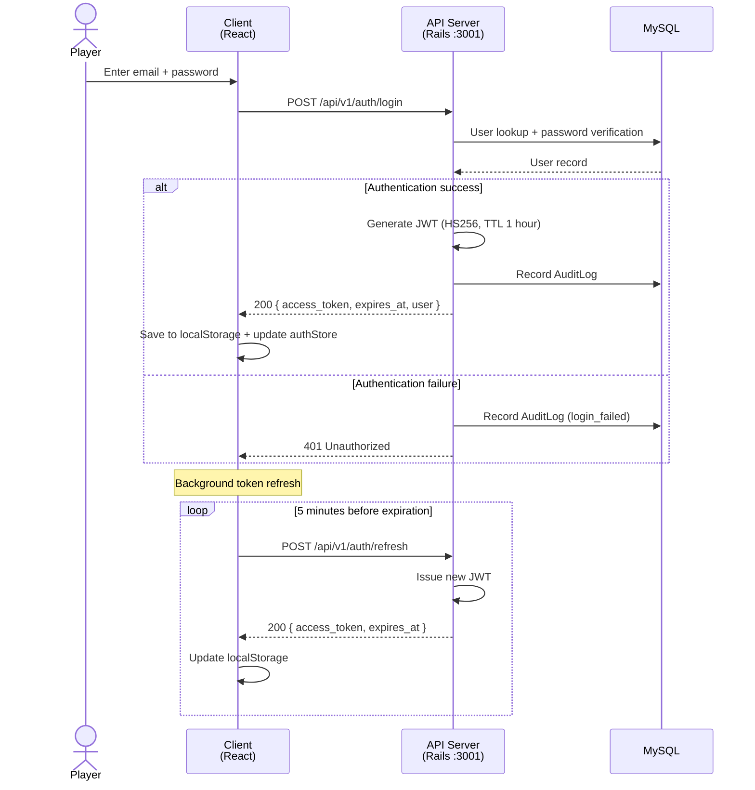
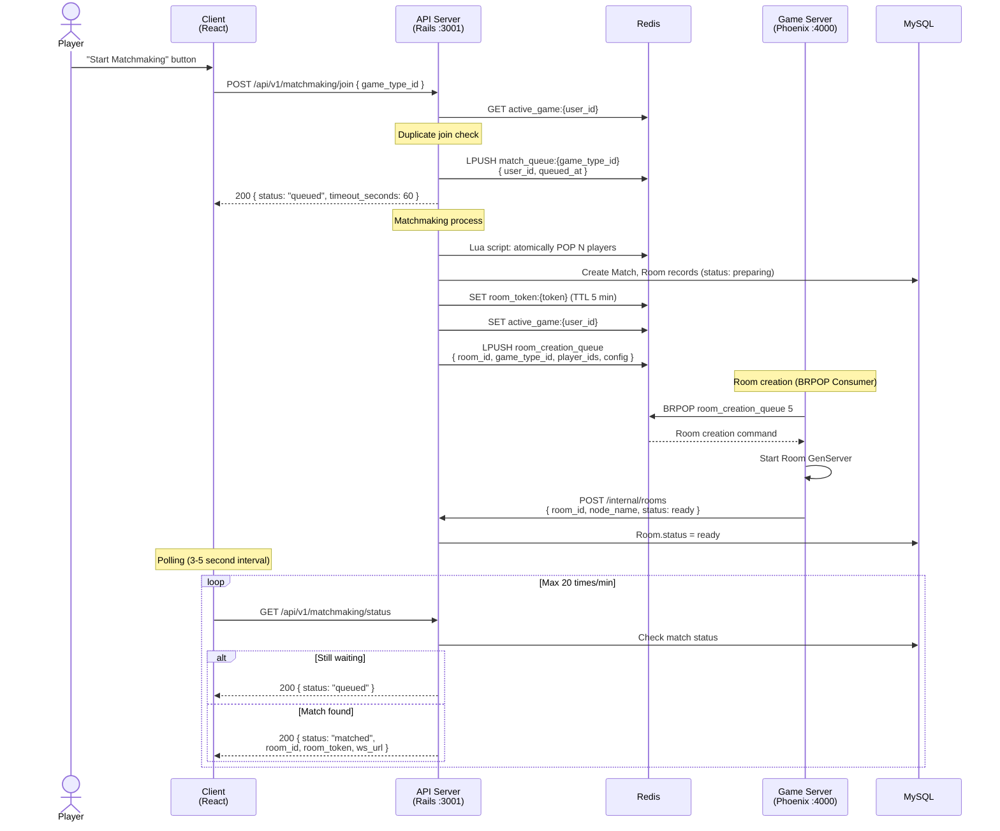
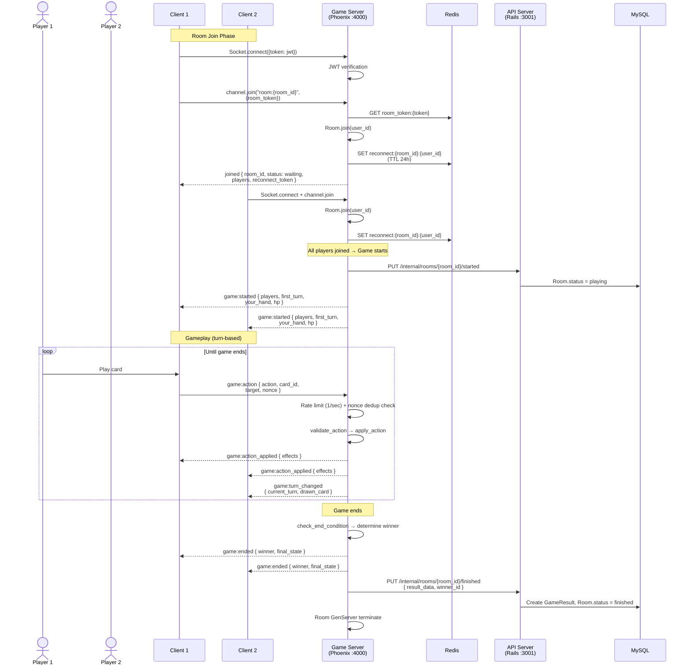
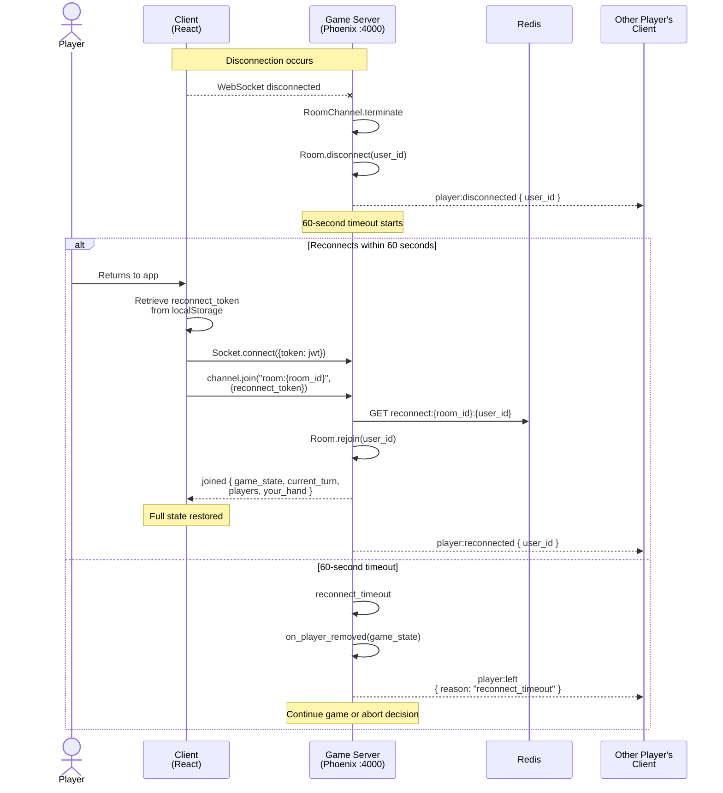
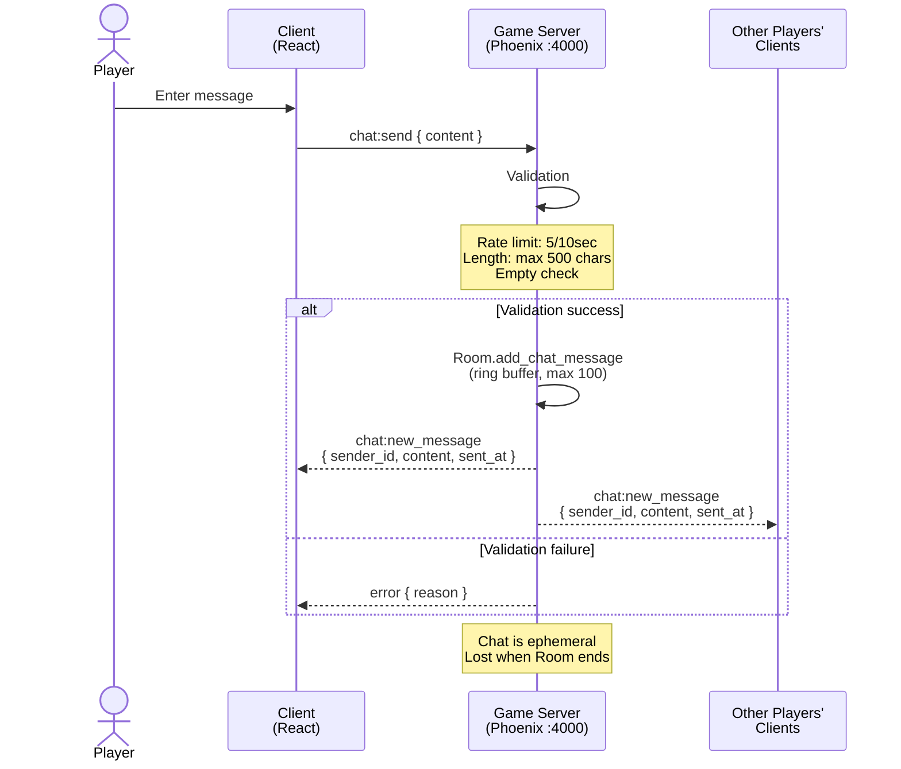
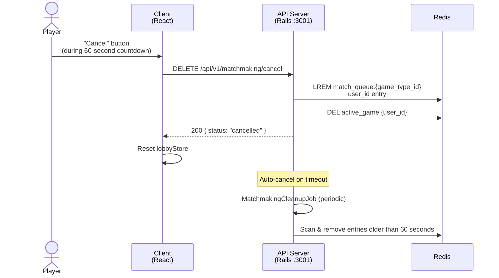
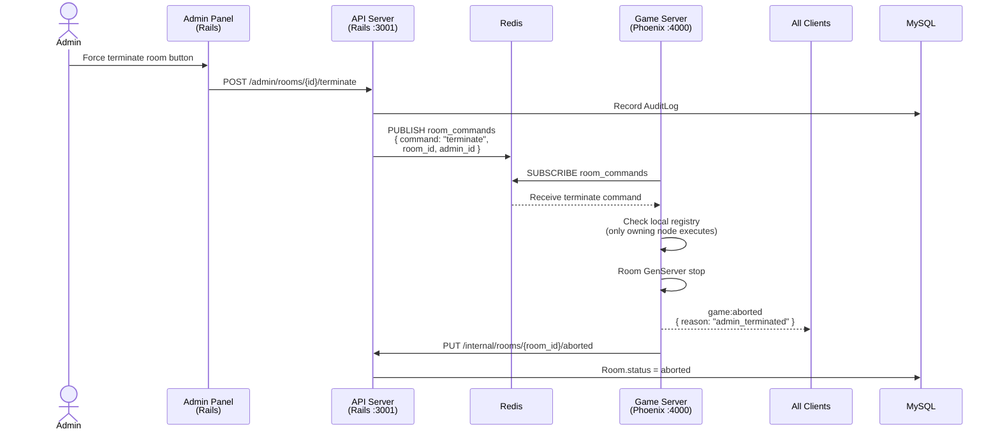
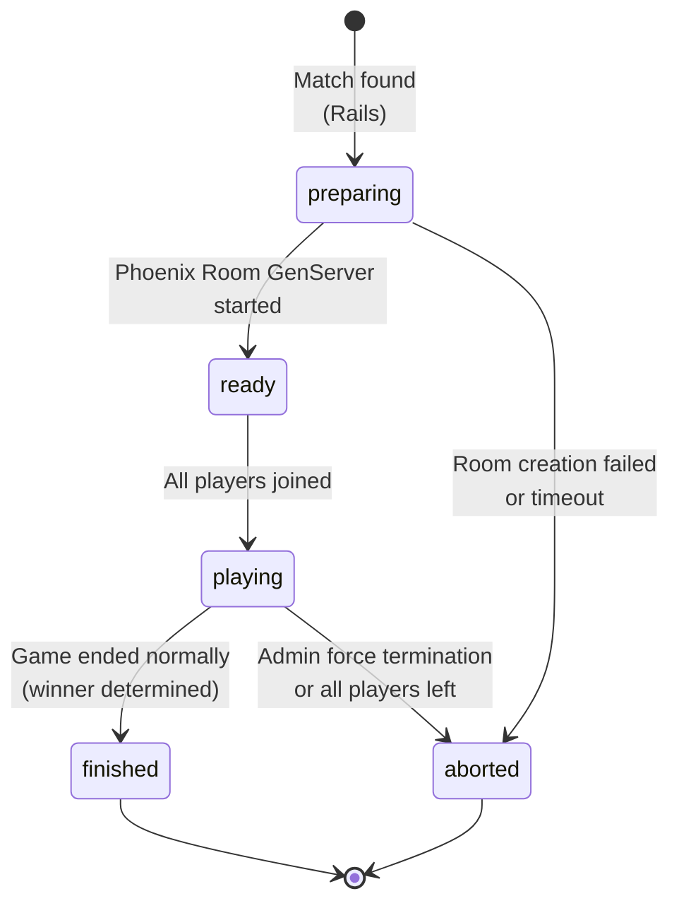

# Key Flow Sequence Diagrams

## 1. Authentication Flow (Login / Registration)

## 2. Matchmaking Flow

## 3. Game Room Lifecycle

## 4. Reconnection Flow

## 5. Chat Flow

## 6. Matchmaking Cancellation Flow

## 7. Admin Operation Flow (Force Terminate Room)

## 8. Room State Transition Diagram

