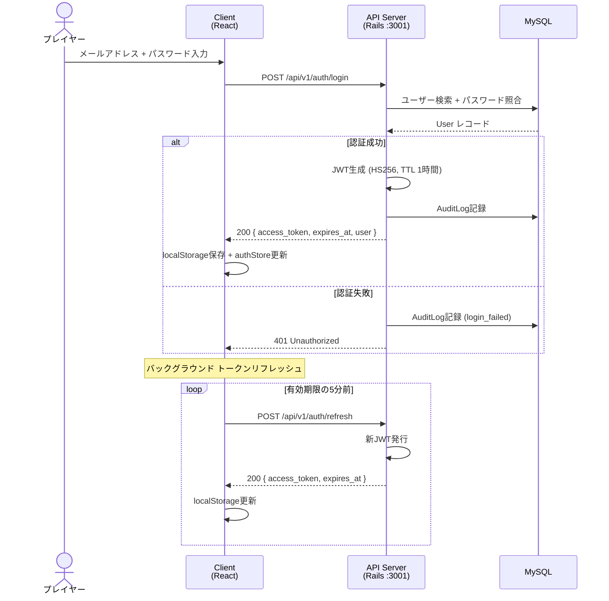
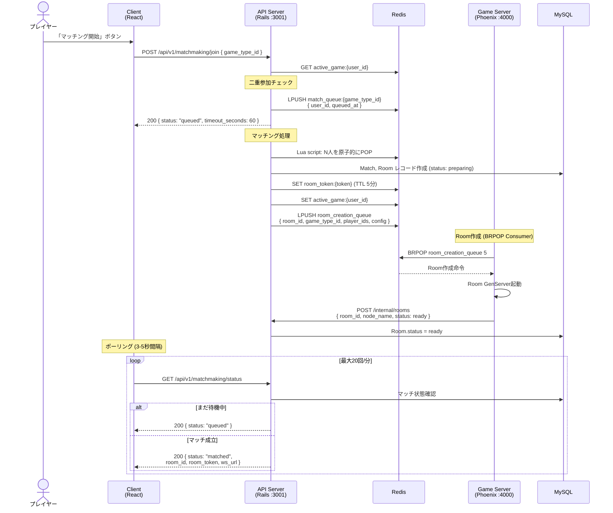
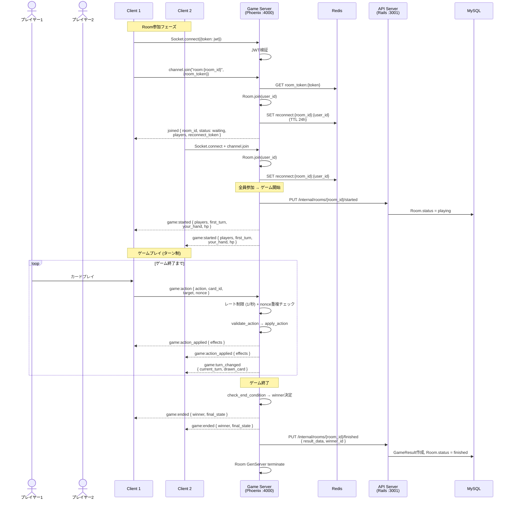
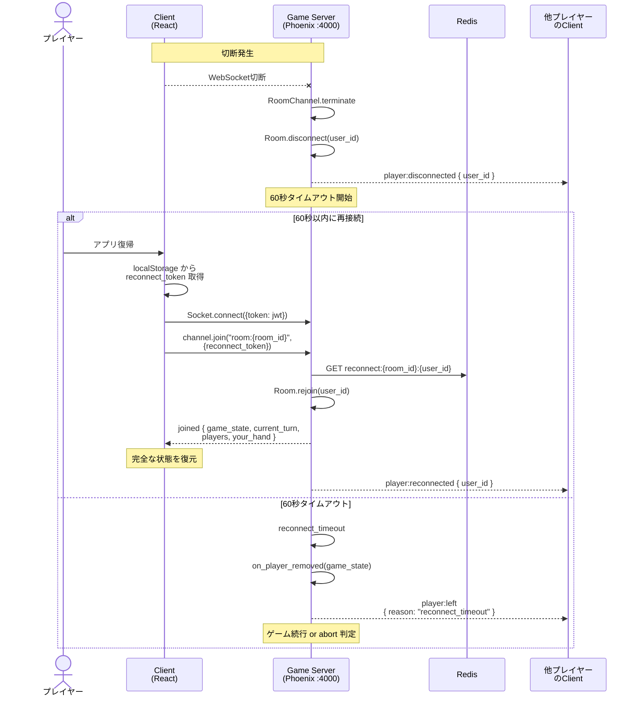
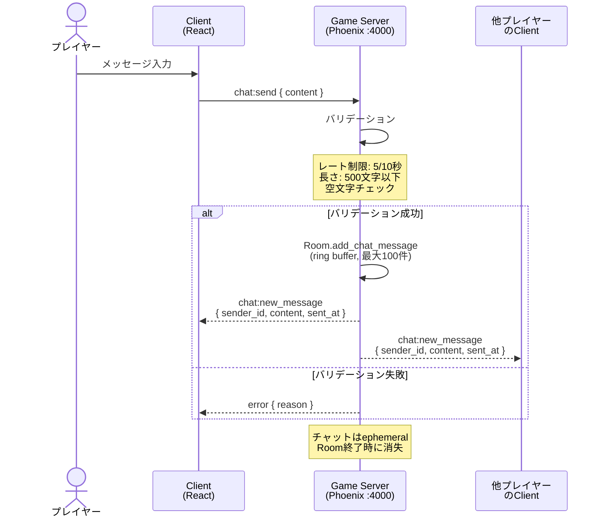
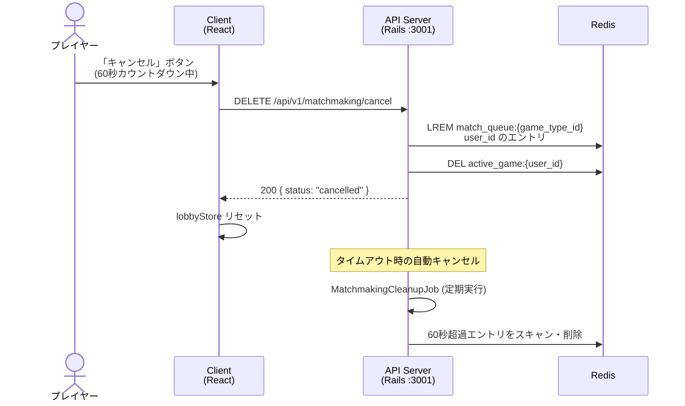
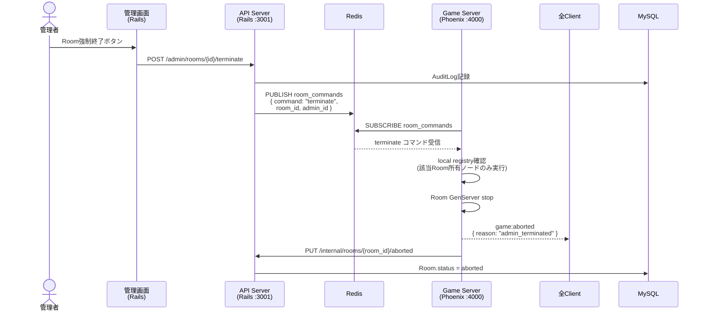
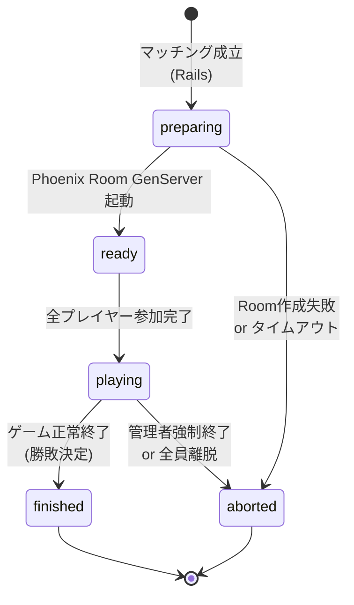

# 主要フロー シーケンス図

## 1. 認証フロー（ログイン / 登録）

```mermaid
sequenceDiagram
    actor Player as プレイヤー
    participant Client as Client<br/>(React)
    participant API as API Server<br/>(Rails :3001)
    participant DB as MySQL

    Player->>Client: メールアドレス + パスワード入力
    Client->>API: POST /api/v1/auth/login
    API->>DB: ユーザー検索 + パスワード照合
    DB-->>API: User レコード

    alt 認証成功
        API->>API: JWT生成 (HS256, TTL 1時間)
        API->>DB: AuditLog記録
        API-->>Client: 200 { access_token, expires_at, user }
        Client->>Client: localStorage保存 + authStore更新
    else 認証失敗
        API->>DB: AuditLog記録 (login_failed)
        API-->>Client: 401 Unauthorized
    end

    Note over Client: バックグラウンド トークンリフレッシュ
    loop 有効期限の5分前
        Client->>API: POST /api/v1/auth/refresh
        API->>API: 新JWT発行
        API-->>Client: 200 { access_token, expires_at }
        Client->>Client: localStorage更新
    end
```

## 2. マッチメイキングフロー

```mermaid
sequenceDiagram
    actor Player as プレイヤー
    participant Client as Client<br/>(React)
    participant API as API Server<br/>(Rails :3001)
    participant Redis as Redis
    participant Game as Game Server<br/>(Phoenix :4000)
    participant DB as MySQL

    Player->>Client: 「マッチング開始」ボタン
    Client->>API: POST /api/v1/matchmaking/join { game_type_id }

    API->>Redis: GET active_game:{user_id}
    Note over API: 二重参加チェック

    API->>Redis: LPUSH match_queue:{game_type_id}<br/>{ user_id, queued_at }
    API-->>Client: 200 { status: "queued", timeout_seconds: 60 }

    Note over API: マッチング処理
    API->>Redis: Lua script: N人を原子的にPOP
    API->>DB: Match, Room レコード作成 (status: preparing)
    API->>Redis: SET room_token:{token} (TTL 5分)
    API->>Redis: SET active_game:{user_id}
    API->>Redis: LPUSH room_creation_queue<br/>{ room_id, game_type_id, player_ids, config }

    Note over Game: Room作成 (BRPOP Consumer)
    Game->>Redis: BRPOP room_creation_queue 5
    Redis-->>Game: Room作成命令
    Game->>Game: Room GenServer起動
    Game->>API: POST /internal/rooms<br/>{ room_id, node_name, status: ready }
    API->>DB: Room.status = ready

    Note over Client: ポーリング (3-5秒間隔)
    loop 最大20回/分
        Client->>API: GET /api/v1/matchmaking/status
        API->>DB: マッチ状態確認
        alt まだ待機中
            API-->>Client: 200 { status: "queued" }
        else マッチ成立
            API-->>Client: 200 { status: "matched",<br/>room_id, room_token, ws_url }
        end
    end
```

## 3. ゲームルームライフサイクル

```mermaid
sequenceDiagram
    actor P1 as プレイヤー1
    actor P2 as プレイヤー2
    participant Client1 as Client 1
    participant Client2 as Client 2
    participant Game as Game Server<br/>(Phoenix :4000)
    participant Redis as Redis
    participant API as API Server<br/>(Rails :3001)
    participant DB as MySQL

    Note over Client1,Client2: Room参加フェーズ
    Client1->>Game: Socket.connect({token: jwt})
    Game->>Game: JWT検証

    Client1->>Game: channel.join("room:{room_id}",<br/>{room_token})
    Game->>Redis: GET room_token:{token}
    Game->>Game: Room.join(user_id)
    Game->>Redis: SET reconnect:{room_id}:{user_id}<br/>(TTL 24h)
    Game-->>Client1: joined { room_id, status: waiting,<br/>players, reconnect_token }

    Client2->>Game: Socket.connect + channel.join
    Game->>Game: Room.join(user_id)
    Game->>Redis: SET reconnect:{room_id}:{user_id}

    Note over Game: 全員参加 → ゲーム開始
    Game->>API: PUT /internal/rooms/{room_id}/started
    API->>DB: Room.status = playing
    Game-->>Client1: game:started { players, first_turn,<br/>your_hand, hp }
    Game-->>Client2: game:started { players, first_turn,<br/>your_hand, hp }

    Note over Client1,Client2: ゲームプレイ (ターン制)
    loop ゲーム終了まで
        P1->>Client1: カードプレイ
        Client1->>Game: game:action { action, card_id,<br/>target, nonce }
        Game->>Game: レート制限 (1/秒) + nonce重複チェック
        Game->>Game: validate_action → apply_action
        Game-->>Client1: game:action_applied { effects }
        Game-->>Client2: game:action_applied { effects }
        Game-->>Client2: game:turn_changed<br/>{ current_turn, drawn_card }
    end

    Note over Game: ゲーム終了
    Game->>Game: check_end_condition → winner決定
    Game-->>Client1: game:ended { winner, final_state }
    Game-->>Client2: game:ended { winner, final_state }
    Game->>API: PUT /internal/rooms/{room_id}/finished<br/>{ result_data, winner_id }
    API->>DB: GameResult作成, Room.status = finished
    Game->>Game: Room GenServer terminate
```

## 4. 再接続フロー

```mermaid
sequenceDiagram
    actor Player as プレイヤー
    participant Client as Client<br/>(React)
    participant Game as Game Server<br/>(Phoenix :4000)
    participant Redis as Redis
    participant OtherClient as 他プレイヤー<br/>のClient

    Note over Client,Game: 切断発生
    Client--xGame: WebSocket切断
    Game->>Game: RoomChannel.terminate
    Game->>Game: Room.disconnect(user_id)
    Game-->>OtherClient: player:disconnected { user_id }

    Note over Game: 60秒タイムアウト開始

    alt 60秒以内に再接続
        Player->>Client: アプリ復帰
        Client->>Client: localStorage から<br/>reconnect_token 取得
        Client->>Game: Socket.connect({token: jwt})
        Client->>Game: channel.join("room:{room_id}",<br/>{reconnect_token})
        Game->>Redis: GET reconnect:{room_id}:{user_id}
        Game->>Game: Room.rejoin(user_id)
        Game-->>Client: joined { game_state, current_turn,<br/>players, your_hand }
        Note over Client: 完全な状態を復元
        Game-->>OtherClient: player:reconnected { user_id }
    else 60秒タイムアウト
        Game->>Game: reconnect_timeout
        Game->>Game: on_player_removed(game_state)
        Game-->>OtherClient: player:left<br/>{ reason: "reconnect_timeout" }
        Note over Game: ゲーム続行 or abort 判定
    end
```

## 5. チャットフロー

```mermaid
sequenceDiagram
    actor Player as プレイヤー
    participant Client as Client<br/>(React)
    participant Game as Game Server<br/>(Phoenix :4000)
    participant Others as 他プレイヤー<br/>のClient

    Player->>Client: メッセージ入力
    Client->>Game: chat:send { content }

    Game->>Game: バリデーション
    Note over Game: レート制限: 5/10秒<br/>長さ: 500文字以下<br/>空文字チェック

    alt バリデーション成功
        Game->>Game: Room.add_chat_message<br/>(ring buffer, 最大100件)
        Game-->>Client: chat:new_message<br/>{ sender_id, content, sent_at }
        Game-->>Others: chat:new_message<br/>{ sender_id, content, sent_at }
    else バリデーション失敗
        Game-->>Client: error { reason }
    end

    Note over Game: チャットはephemeral<br/>Room終了時に消失
```

## 6. マッチメイキング キャンセルフロー

```mermaid
sequenceDiagram
    actor Player as プレイヤー
    participant Client as Client<br/>(React)
    participant API as API Server<br/>(Rails :3001)
    participant Redis as Redis

    Player->>Client: 「キャンセル」ボタン<br/>(60秒カウントダウン中)
    Client->>API: DELETE /api/v1/matchmaking/cancel

    API->>Redis: LREM match_queue:{game_type_id}<br/>user_id のエントリ
    API->>Redis: DEL active_game:{user_id}
    API-->>Client: 200 { status: "cancelled" }
    Client->>Client: lobbyStore リセット

    Note over API: タイムアウト時の自動キャンセル
    API->>API: MatchmakingCleanupJob (定期実行)
    API->>Redis: 60秒超過エントリをスキャン・削除
```

## 7. 管理操作フロー（Room強制終了）

```mermaid
sequenceDiagram
    actor Admin as 管理者
    participant AdminUI as 管理画面<br/>(Rails)
    participant API as API Server<br/>(Rails :3001)
    participant Redis as Redis
    participant Game as Game Server<br/>(Phoenix :4000)
    participant Clients as 全Client
    participant DB as MySQL

    Admin->>AdminUI: Room強制終了ボタン
    AdminUI->>API: POST /admin/rooms/{id}/terminate
    API->>DB: AuditLog記録
    API->>Redis: PUBLISH room_commands<br/>{ command: "terminate",<br/>room_id, admin_id }

    Game->>Redis: SUBSCRIBE room_commands
    Redis-->>Game: terminate コマンド受信

    Game->>Game: local registry確認<br/>(該当Room所有ノードのみ実行)
    Game->>Game: Room GenServer stop

    Game-->>Clients: game:aborted<br/>{ reason: "admin_terminated" }
    Game->>API: PUT /internal/rooms/{room_id}/aborted
    API->>DB: Room.status = aborted
```

## 8. Room状態遷移図

```mermaid
stateDiagram-v2
    [*] --> preparing: マッチング成立<br/>(Rails)

    preparing --> ready: Phoenix Room GenServer 起動
    ready --> playing: 全プレイヤー参加完了

    playing --> finished: ゲーム正常終了<br/>(勝敗決定)
    playing --> aborted: 管理者強制終了<br/>or 全員離脱

    preparing --> aborted: Room作成失敗<br/>or タイムアウト

    finished --> [*]
    aborted --> [*]
```
