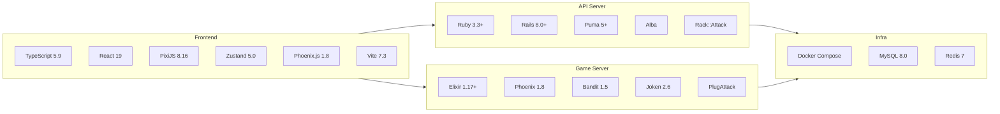

# Technology Stack

## Overview Diagram

## Client (Web Frontend)

| Category | Technology | Version | Purpose |
|----------|-----------|---------|---------|
| Language | TypeScript | ~5.9.3 | Type-safe development |
| UI Framework | React | ^19.2.0 | Component-based UI |
| Game Rendering | PixiJS | ^8.16.0 | 2D game rendering engine |
| State Management | Zustand | ^5.0.11 | Lightweight store (auth, lobby, game, chat) |
| WebSocket | Phoenix.js | ^1.8.3 | Phoenix Channel client |
| Validation | Zod | ^4.3.6 | Runtime schema validation |
| ID Generation | UUID | ^13.0.0 | UUID generation for nonces, etc. |
| Build | Vite | ^7.3.1 | Fast bundler + HMR |
| Linter/Formatter | Biome | ^2.3.14 | Integrated lint + format tool |
| Testing | Vitest | ^3.2.4 | Vite-native test runner |
| Testing | Testing Library | - | React component testing |

## API Server (Ruby on Rails)

| Category | Technology | Version | Purpose |
|----------|-----------|---------|---------|
| Language | Ruby | 3.3+ | Server-side language |
| Framework | Rails | ~8.1.2 | REST API + Admin panel |
| Web Server | Puma | >= 5.0 | Multi-threaded HTTP server |
| DB | MySQL2 | ~0.5 | MySQL connection adapter |
| Cache/Queue | Redis | ~5.0 | Queue operations / KV / PubSub |
| Auth | JWT (ruby-jwt) | - | JWT token issuance & verification |
| Password | BCrypt | ~3.1.7 | Password hashing |
| JSON | Alba | - | High-performance JSON serializer |
| Security | Rack::Attack | - | Rate limiting |
| CORS | Rack-CORS | - | Cross-origin support |
| Testing | RSpec | - | BDD test framework |
| Testing | Factory Bot | - | Test data generation |
| Testing | Shoulda Matchers | - | Model validation testing |

## Game Server (Elixir/Phoenix)

| Category | Technology | Version | Purpose |
|----------|-----------|---------|---------|
| Language | Elixir | ~1.17+ | Functional & concurrent language |
| Runtime | Erlang/OTP | 27+ | BEAM VM |
| Framework | Phoenix | ~1.8.3 | WebSocket + Channels |
| HTTP Server | Bandit | ~1.5 | Elixir-native HTTP server |
| JSON | Jason | ~1.2 | High-performance JSON parser |
| JWT | Joken | ~2.6 | JWT verification |
| Redis | Redix | ~1.5 | Redis connection |
| HTTP | Req + Finch | ~0.5 / ~0.19 | Rails internal API calls |
| Cache | Cachex | ~3.6 | In-memory cache |
| Security | PlugAttack | ~0.4 | Rate limiting |
| ID | UUID | ~1.1 | UUID generation |
| Testing | ExUnit | - | Standard test framework |
| Testing | Mox | ~1.1 | Behaviour-based mocking |

## Infrastructure

| Technology | Version | Purpose |
|-----------|---------|---------|
| Docker | - | Containerization |
| Docker Compose | - | Multi-service orchestration |
| MySQL | 8.0 | RDB (users, rooms, matches, game_results) |
| Redis | 7-alpine | Queue / KV / PubSub / Cache |

## Network Configuration

| Service | Port | Protocol |
|---------|------|----------|
| Client (Vite dev server) | 3000 | HTTP |
| API Server (Puma) | 3001 | HTTP (REST API) |
| Game Server (Bandit) | 4000 | HTTP + WebSocket |
| MySQL | 3306 | TCP |
| Redis | 6379 | TCP |

All services are connected via the Docker Compose `app-network` (bridge).

## Security

| Feature | Implementation |
|---------|---------------|
| Auth | JWT (HS256, TTL 1 hour, shared secret) |
| Password | BCrypt hash |
| Rate Limiting | Rack::Attack (Rails) / PlugAttack (Phoenix) |
| CORS | rack-cors |
| Replay Attack Prevention | UUID nonce (game:action) |
| Internal API Auth | Shared INTERNAL_API_KEY header |
