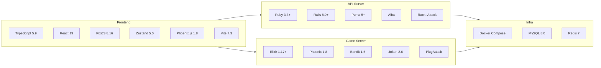

# 技術スタック

## 概要図

## Client (Webフロントエンド)

| カテゴリ | 技術 | バージョン | 用途 |
|---------|------|----------|------|
| 言語 | TypeScript | ~5.9.3 | 型安全な開発 |
| UIフレームワーク | React | ^19.2.0 | コンポーネントベースUI |
| ゲーム描画 | PixiJS | ^8.16.0 | 2Dゲーム描画エンジン |
| 状態管理 | Zustand | ^5.0.11 | 軽量ストア (auth, lobby, game, chat) |
| WebSocket | Phoenix.js | ^1.8.3 | Phoenix Channel クライアント |
| バリデーション | Zod | ^4.3.6 | ランタイムスキーマバリデーション |
| ID生成 | UUID | ^13.0.0 | nonce等のUUID生成 |
| ビルド | Vite | ^7.3.1 | 高速バンドラー + HMR |
| Linter/Formatter | Biome | ^2.3.14 | Lint + Format 統合ツール |
| テスト | Vitest | ^3.2.4 | Vite ネイティブテストランナー |
| テスト | Testing Library | - | React コンポーネントテスト |

## API Server (Ruby on Rails)

| カテゴリ | 技術 | バージョン | 用途 |
|---------|------|----------|------|
| 言語 | Ruby | 3.3+ | サーバーサイド言語 |
| フレームワーク | Rails | ~8.1.2 | REST API + 管理画面 |
| Webサーバー | Puma | >= 5.0 | マルチスレッドHTTPサーバー |
| DB | MySQL2 | ~0.5 | MySQL接続アダプター |
| キャッシュ/キュー | Redis | ~5.0 | キュー操作 / KV / PubSub |
| 認証 | JWT (ruby-jwt) | - | JWTトークン発行・検証 |
| パスワード | BCrypt | ~3.1.7 | パスワードハッシュ |
| JSON | Alba | - | 高速JSONシリアライザ |
| セキュリティ | Rack::Attack | - | レート制限 |
| CORS | Rack-CORS | - | クロスオリジン対応 |
| テスト | RSpec | - | BDDテストフレームワーク |
| テスト | Factory Bot | - | テストデータ生成 |
| テスト | Shoulda Matchers | - | モデルバリデーションテスト |

## Game Server (Elixir/Phoenix)

| カテゴリ | 技術 | バージョン | 用途 |
|---------|------|----------|------|
| 言語 | Elixir | ~1.17+ | 関数型・並行処理言語 |
| ランタイム | Erlang/OTP | 27+ | BEAM VM |
| フレームワーク | Phoenix | ~1.8.3 | WebSocket + Channel |
| HTTPサーバー | Bandit | ~1.5 | Elixir ネイティブHTTPサーバー |
| JSON | Jason | ~1.2 | 高速JSONパーサー |
| JWT | Joken | ~2.6 | JWT検証 |
| Redis | Redix | ~1.5 | Redis接続 |
| HTTP | Req + Finch | ~0.5 / ~0.19 | Rails内部API呼び出し |
| キャッシュ | Cachex | ~3.6 | インメモリキャッシュ |
| セキュリティ | PlugAttack | ~0.4 | レート制限 |
| ID | UUID | ~1.1 | UUID生成 |
| テスト | ExUnit | - | 標準テストフレームワーク |
| テスト | Mox | ~1.1 | Behaviour ベースモック |

## インフラストラクチャ

| 技術 | バージョン | 用途 |
|------|----------|------|
| Docker | - | コンテナ化 |
| Docker Compose | - | マルチサービスオーケストレーション |
| MySQL | 8.0 | RDB (users, rooms, matches, game_results) |
| Redis | 7-alpine | キュー / KV / PubSub / キャッシュ |

## ネットワーク構成

| サービス | ポート | プロトコル |
|---------|-------|----------|
| Client (Vite dev server) | 3000 | HTTP |
| API Server (Puma) | 3001 | HTTP (REST API) |
| Game Server (Bandit) | 4000 | HTTP + WebSocket |
| MySQL | 3306 | TCP |
| Redis | 6379 | TCP |

すべてのサービスは Docker Compose の `app-network` (bridge) で接続されます。

## セキュリティ

| 機能 | 実装 |
|------|------|
| 認証 | JWT (HS256, TTL 1時間, 共有シークレット) |
| パスワード | BCrypt ハッシュ |
| レート制限 | Rack::Attack (Rails) / PlugAttack (Phoenix) |
| CORS | rack-cors |
| Replay攻撃対策 | UUID nonce (game:action) |
| 内部API認証 | 共有 INTERNAL_API_KEY ヘッダー |
